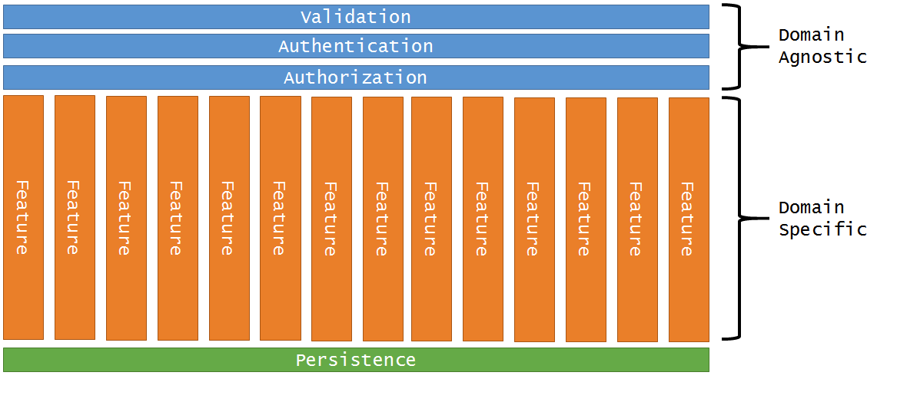

This blog is a step by step tutorial that transforms a default MVC 5 application into [Jimmy Bogard's](https://lostechies.com/jimmybogard/) Feature-oriented configuration as described in his [presentation](https://lostechies.com/jimmybogard/2015/07/02/ndc-talk-on-solid-in-slices-not-layers-video-online/). His sample project located [here](https://github.com/jbogard/ContosoUniversity "here") was used to guide the way.  The VSIX package and source code of this presentation are available 
[here](http://steventcramer.github.io/assets/pictures/jimmy-mvc/JimmyMvcVsixProject.vsix).

<!-- more -->

# Background #

## Layers to Features ##

**From:**


**To:** 



## What is a feature ##

A feature is a small vertical slice of a website. The **M**odel, **V**iew and **C**ontroller of a **single url**.  It can contain the following:
- Query
- QueryValidater
- QueryHandler
- Result
- Command
- CommandValidater
- CommandHandler
- UiController
- MappingProfile
- View  

A Feature handles the `get` and or `post` of an HTTP request for a single URL.  
Examples: `http://localhost/User/Index`, `http://localhost/User/Create` 
It can be synchronous or asynchronous, and can have a redirect to URL/Feature upon command success.  Features use the **CQRS light** design pattern.

## CQRS Light##
The CQRS (Command Query Responsibility Segregation) pattern means many different things to different people.  The full blown CQRS with dual domain models and event sourcing etc. gets a bit overwhelming rather quickly.  "[CQRS Light](https://lostechies.com/jimmybogard/2015/05/05/cqrs-with-mediatr-and-automapper/)" is just the splitting of Features into Queries and Commands.  A single domain model is the starting point and will not be split unless circumstances drive the need, which is unlikely.  There is no event sourcing and most messaging is done in-process using MediatR.

The Http protocol correlates rather well with CQRS Light.

Get = Read = Query
Post = Write = Command

The MediatR Nuget package will be used to implement CQRS light.


This should all become clear as we implement. Let's get started.

# Tutorial #
## Create Default MVC 5 Application ##

 Create New Project named JimmyMvc


 
Choose `MVC` and Press `Change Authentication` and select "No Authentication" 


Deselect `Host in the cloud`


Select Ok to create the project.

Run the app to confirm it works as is.


 
Select *Tools->NuGet Package Manager->Package Manager Console* and enter: 

`Update-Package`

Alternatively Select *Tools->NuGet Package Manager->Manage NuGet Packages for Solution*

Upgrade all to the latest stable version.

Run the app to confirm it still works.

## Configure JustCode/ReSharper/CodeRush

These tools are not required but they sure are handy.  Take some time to configure them and they will help make your code cleaner and more consistent.  This will not be covered here.

## Rename Views to Features ##

Rename the `Views` folder to `Features`


So now if you run the app you will get an error:

```

The view 'Index' or its master was not found or no view engine supports the searched locations. The following locations were searched:
~/Views/Home/Index.aspx
~/Views/Home/Index.ascx
~/Views/Shared/Index.aspx
~/Views/Shared/Index.ascx
~/Views/Home/Index.cshtml
~/Views/Home/Index.vbhtml
~/Views/Shared/Index.cshtml
~/Views/Shared/Index.vbhtml

```
 
To fix this we change the view engine to one that looks in the proper location:
 
Create a new root folder named `Infrastructure`


Inside the Infrastructure folder Create new class named: `FeatureRazorViewEngine`  
 
Implement as follows:

```csharp


namespace JimmyMvc.Infrastructure
{
	using System.Web.Mvc;

	public class FeatureRazorViewEngine : RazorViewEngine
	{
		public FeatureRazorViewEngine()
		{
			ViewLocationFormats = new[]
			{
				"~/Features/{1}/{0}.cshtml",
				"~/Features/{1}/{0}.vbhtml",
				"~/Features/Shared/{0}.cshtml",
				"~/Features/Shared/{0}.vbhtml",
			};

			MasterLocationFormats = ViewLocationFormats;
			PartialViewLocationFormats = ViewLocationFormats;
		}
	}
}
```
  
To use the new ViewEngine, update the `Global.asax.cs` as follows:


```csharp


namespace JimmyMvc
{
	using Infrastructure;
	using System.Web.Mvc;
	using System.Web.Optimization;
	using System.Web.Routing;

	public class MvcApplication : System.Web.HttpApplication
	{
		protected void Application_Start()
		{
			AreaRegistration.RegisterAllAreas();
			FilterConfig.RegisterGlobalFilters(GlobalFilters.Filters);
			RouteConfig.RegisterRoutes(RouteTable.Routes);
			BundleConfig.RegisterBundles(BundleTable.Bundles);

			// Replace Default ViewEngine with Feature version
			ViewEngines.Engines.Clear();
			ViewEngines.Engines.Add(new FeatureRazorViewEngine());
		}
	}
}

```
 
Running the application now should give you :
 
    The layout page "~/Views/Shared/_Layout.cshtml" could not be found at the following path: "~/Views/Shared/_Layout.cshtml".
 
 
To fix this, Update the `_ViewStart.cshtml` to point to the Feature based site Layout location.

```csharp


@{
    Layout = "~/Features/Shared/_Layout.cshtml";
}
```
 
Your application will now function using the "Feature" folder instead of the "View" folder.
 
 
 
## Removing the Controllers Folder ##
 
Move `HomeController.cs` to the `Features\Home` directory and delete the Controllers folder.
 
Using the feature concept we no longer have to indicate the purpose of the controller by calling it <*Home*>Controller.  Given it is in the *Home* namespace the prefix becomes redundant.
 
Rename `HomeController.cs` to `UiController.cs` and the class name to `UiController`
 
Update the namespace inside the file.

```csharp


namespace JimmyMvc.Features.Home
```
 
Running the application will now give an error:
 

    The resource cannot be found.
 
The URL format is set in the `RouteConfig` as follows: (*Notice this is the default and is not changed.*)

```csharp


routes.MapRoute(
				name: "Default",
				url: "{controller}/{action}/{id}",
				defaults: new { controller = "Home", action = "Index", id = UrlParameter.Optional });
```
MVC controllers are created using the `DefaultControllerFactory.CreateController` and it uses a naming convention of `<controllerName>Controller` to get the controller type.  This will no longer work with our new feature based naming convention.

To fix this create your own controller factory class in the `Infrastructure` Folder as follows:

```csharp


namespace JimmyMvc.Infrastructure
{
	using System;
	using System.Web.Mvc;
	using System.Web.Routing;

	public class ControllerFactory : DefaultControllerFactory
	{
		protected override Type GetControllerType(RequestContext aRequestContext, string aControllerName)
		{
			string action = aRequestContext.RouteData.GetRequiredString(valueName: "action");
			string typeName = "JimmyMvc.Features." + aControllerName + ".UiController";

			System.Reflection.Assembly assembly = typeof(ControllerFactory).Assembly;
			Type type = assembly.GetType(typeName);
			return type;
		}
	}
}
```

To use this controller factory set it directly in the `Global.asax.cs` file using:

```csharp


ControllerBuilder.Current.SetControllerFactory(new JimmyMvc.Infrastructure.ControllerFactory());
```
Later after we add an IoC container this will need to be removed.

At this point the `Global.asax.cs` file should be as follows:

```csharp


namespace JimmyMvc
{
	using Infrastructure;
	using System.Web.Mvc;
	using System.Web.Optimization;
	using System.Web.Routing;

	public class MvcApplication : System.Web.HttpApplication
	{
		protected void Application_Start()
		{
			AreaRegistration.RegisterAllAreas();
			FilterConfig.RegisterGlobalFilters(GlobalFilters.Filters);
			RouteConfig.RegisterRoutes(RouteTable.Routes);
			BundleConfig.RegisterBundles(BundleTable.Bundles);

			// Replace Default ViewEngine with Feature version
			ViewEngines.Engines.Clear();
			ViewEngines.Engines.Add(new FeatureRazorViewEngine());

			//Replace Default Controller factor with Feature version
			ControllerBuilder.Current.SetControllerFactory(new JimmyMvc.Infrastructure.ControllerFactory());
		}
	}
}

```

The Application should now run.  But what is the purpose of this application?

## The Business Case##

A Company wants to automate their purchase order (PO) approval process. To reduce clutter and wasted time, they want to establish a hierarchy for approval.  People in the first group must approve before requesting action from the second.  All of the people in the list must approve the PO in order for the funds to be allocated and the PO be issued as approved.

Typically the team that is closest to the project, needs to approve first.  If all of them approve then the next group will be notified and requested to approve or reject.  This second group is often a set of managers involved in a project.  Finally, the next group, potentially senior executives are involved. Lastly, one person must have the financial signing authority to release the funds.

This blog only covers the implementation of "Approval List **Templates**" which can be reused when the user actually wants to request approval of a purchase order. The process of requesting approval of the purchase order is another business component and is not covered in this post.

Sample "Approval List Template" names are ... "Minimal Approval", "Medium Approval", "The Big Dogs"

### Class Diagram ###


Granted this model is pretty simple in that the behavior is just CRUD. The use of the ApprovalListTemplate will have more domain behavior and possibly could be the topic of a future blog.

### Use Case ###

Let's get started with our first use case. 

As an administrator, we need to be able to maintain a set of users for the application.  

TODO Use case Diagram here

Being able to persist users will require a database.  For this case we will use Entity Framework on top of SQL Server.


### Add Entity Framework 6 ###
Create a root folder named `Entities` and select it.


Press Ctrl-Shift-A To add a new item.

Select Visual C#->Data-> ADO.NET Entity Data Model And Name it "Model" 


Select Empty Code First model and then Finish


This will add the Entity Framework Nuget package to your project and Create a `Model.cs` file and update your `Web.config`

Make sure the Entity Framework Nuget is up to date using Nuget Package Manager.

### DelegateDecompiler.EntityFramework ###
Install [Nuget DelegateDecompiler.EntityFramework](https://www.nuget.org/packages/DelegateDecompiler.EntityFramework/0.16.0 "Nuget") See the [github](https://github.com/hazzik/DelegateDecompiler "Delegate Decompile") page.


This will give you the `Computed` attribute and improved linq operations with it.

## User ##

Now add a new class in the Entities folder named User.

```csharp


namespace JimmyMvc.Entities
{
	using System.ComponentModel.DataAnnotations;
	using DelegateDecompiler;

	public class User
	{
		public int UserId { get; set; }

		public string LastName { get; set; }

		[Display(Name = "First Name")]
		public string FirstAndMiddleName { get; set; }

		[Computed]
		public string FullName
		{
			get
			{
				return LastName + ", " + FirstAndMiddleName;
			}
		}

	}
}
```

Compile. To Ensure the application builds.

Update `Model.cs` to add the DbSet for the User class and to not pluralize the table names:

```csharp


namespace JimmyMvc.Entities
{
	using System;
	using System.Data.Entity;
	using System.Data.Entity.ModelConfiguration.Conventions;
	using System.Linq;

	public class Model : DbContext
	{
		// Your context has been configured to use a 'Model' connection string from your application's 
		// configuration file (App.config or Web.config). By default, this connection string targets the 
		// 'JimmyMvc.Model' database on your LocalDb instance. 
		// 
		// If you wish to target a different database and/or database provider, modify the 'Model' 
		// connection string in the application configuration file.
		public Model()
				: base(nameOrConnectionString: "name=Model")
		{
		}

		// Add a DbSet for each entity type that you want to include in your model. For more information 
		// on configuring and using a Code First model, see http://go.microsoft.com/fwlink/?LinkId=390109.

		// public virtual DbSet<MyEntity> MyEntities { get; set; }
		public virtual DbSet<User> Users { get; set; }

		protected override void OnModelCreating(DbModelBuilder aDbModelBuilder)
		{
			aDbModelBuilder.Conventions.Remove<PluralizingTableNameConvention>();
		}
	}
}
```

## Create Database Initializer ##

Add a new class named `ModelInitializer` to the `Entities` Folder as follows:

```csharp


namespace JimmyMvc.Entities
{
	using System.Collections.Generic;

	public class ModelInitializer : System.Data.Entity.DropCreateDatabaseIfModelChanges<Model>
	{
		protected override void Seed(Model aModel)
		{
			base.Seed(aModel);

			var users = new List<User>
			{
				new User{FirstAndMiddleName="Carson"  ,LastName="Alexander" },
				new User{FirstAndMiddleName="Meredith",LastName="Alonso"    },
				new User{FirstAndMiddleName="Arturo"  ,LastName="Anand"     },
				new User{FirstAndMiddleName="Gytis"   ,LastName="Barzdukas" },
				new User{FirstAndMiddleName="Yan"     ,LastName="Li"        },
				new User{FirstAndMiddleName="Peggy"   ,LastName="Justice"   },
				new User{FirstAndMiddleName="Laura"   ,LastName="Norman"    },
				new User{FirstAndMiddleName="Nino"    ,LastName="Olivetto"  }
			};

			users.ForEach(aUser => aModel.Users.Add(aUser));
			aModel.SaveChanges();
		}
	}
}
```

Tell Entity Framework to use your initializer class by adding the following to the `Global.asax.cs` file as shown and the proper using statments:

```csharp


	// Set Database Initializer
	Database.SetInitializer<Model>(new ModelInitializer());
```

The intializer will execute on first use.  If you want the initializer to execute immediately add the following code in the `Global.asax.cs` following the above. 

```csharp


	using (var model = new Model())
	{
		model.Database.Initialize(false);
	}
```
`Global.asax.cs` should now be as follows:

```csharp


namespace JimmyMvc
{
	using Infrastructure;
	using Entities;
	using System.Web.Mvc;
	using System.Web.Optimization;
	using System.Web.Routing;
	using System.Data.Entity;

	public class MvcApplication : System.Web.HttpApplication
	{
		protected void Application_Start()
		{
			AreaRegistration.RegisterAllAreas();
			FilterConfig.RegisterGlobalFilters(GlobalFilters.Filters);
			RouteConfig.RegisterRoutes(RouteTable.Routes);
			BundleConfig.RegisterBundles(BundleTable.Bundles);

			// Replace Default ViewEngine with Feature version
			ViewEngines.Engines.Clear();
			ViewEngines.Engines.Add(new FeatureRazorViewEngine());

			//Replace Default Controller factor with Feature version
			ControllerBuilder.Current.SetControllerFactory(new JimmyMvc.Infrastructure.ControllerFactory());

			// Set Database Initializer
			Database.SetInitializer<Model>(new ModelInitializer());

			using (var model = new Model())
			{
				model.Database.Initialize(force: false);
			}
		}
	}
}


```

Execute the application now.  And the database should be created and populated with data.


Let's get started implementing our first Feature and building the infrastructure needed to support it.   
 
## Feature 1: Display the list of users ##  

The URL for the Feature will be `/User/Index`

We will store all of the Features in the Features folder organized by the Entity/Aggregate root of which they are associated. So add a `User` folder under the Features folder.


Add a class named `Index` to the `User` folder.  This will contain the Features logic.

Add an `Index` view by right clicking on the `User` folder and selecting `Add->MVC 5 View Page (Razor)` 

Nest the `Index.cshtml` file under the `Index.cs` file to keep the solution organized, using the [File Nesting](https://visualstudiogallery.msdn.microsoft.com/3ebde8fb-26d8-4374-a0eb-1e4e2665070c) add-in. 

Replace the default `index.cshtml` code with the following temporary code which is just used so we can see something when the view renders. We will update this later.

```csharp


<div>
	List of Users
</div>

```

Add a link to the main menu in the `Features\Shared\_Layout.cshtml` to the Users page.


```csharp


...
<li>@Html.ActionLink("Users", "Index", "User")</li>
...
```

Now add a controller to the Feature.

Nested inside the Index class add a controller.  

Given that each feature now represents a single url the name of the controller method no longer needs to correspond to the url as there can only be one method for `get` and one for `post` on each controller.  So we will name all of our methods "Action" and thus give us the opportunity to be more DRY.  A controller class now can represent a single url.  We will use this knowledge later when we create a `LinkBuilder` class.

Your `User\Index.cs` file should be as follows:

```csharp


namespace JimmyMvc.Features.User
{
	using System.Web.Mvc;

	public class Index
	{
		public class UiController : Controller
		{
			public virtual ActionResult Action()
			{
				return View();
			}
		}
	}
}

```

Execute the app and attempt to navigate to the Users page. 

You will get `The resource cannot be found.` error. This is because the controller can not be found using our Controller Factory.  The current factory is looking for a controller of type "JimmyMvc.Features.User.UiController" and a method named "Index".

Our controller's fully qualified name is "JimmyMvc.Features.User.Index+UiController" because we have embedded it inside the feature.  So we either have to change the factory, or not embed the controller.  Having done this both ways I chose to embed the controller as this allows for a more [DRY](https://en.wikipedia.org/wiki/Don%27t_repeat_yourself) solution.  Also the method we are looking for is always named `Action` we will address this also in the controller factory.

So let's update the factory.

```csharp


namespace JimmyMvc.Infrastructure
{
	using System;
	using System.Web.Mvc;
	using System.Web.Mvc.Async;
	using System.Web.Routing;

	public class ControllerFactory : DefaultControllerFactory
	{
		protected override Type GetControllerType(RequestContext aRequestContext, string aControllerName)
		{
			string action = aRequestContext.RouteData.GetRequiredString(valueName: "action");
			string typeName = "JimmyMvc.Features." + aControllerName + "." + action + "+UiController";

			System.Reflection.Assembly assembly = typeof(ControllerFactory).Assembly;
			Type type = assembly.GetType(typeName);
			return type;
		}

		public override IController CreateController(RequestContext aRequestContext, string aControllerName)
		{
			IController controller = base.CreateController(aRequestContext, aControllerName);
			return ReplaceActionInvoker(controller);
		}

		private IController ReplaceActionInvoker(IController aController)
		{
			var mvcController = aController as Controller;
			if (mvcController != null)
			{
				mvcController.ActionInvoker = new FeatureActionInvoker();
			}

			return aController;
		}

		public class FeatureActionInvoker : AsyncControllerActionInvoker
		{
			protected override ActionDescriptor FindAction(ControllerContext aControllerContext, ControllerDescriptor aControllerDescriptor, string aActionName)
			{
				return base.FindAction(aControllerContext, aControllerDescriptor, actionName: "Action");
			}
		}
	}
}

```

Executing the application and navigating to the home url (Home/Index) will now give "The resource cannot be found." but when you manually enter /User/Index you should see the view page.

So let's fix the `Home/About`, `Home/Contact`, `Home/Index` Features 

under `Features\Home` Create classes named `About`, `Contact` and `Index`.


Take the existing controller and split it up among the respective classes.

The Existing Controller: 

```csharp


namespace JimmyMvc.Features.Home
{
	using System;
	using System.Linq;
	using System.Web.Mvc;

	public class UiController : Controller
	{
		public ActionResult Index()
		{
			return View();
		}

		public ActionResult About()
		{
			ViewBag.Message = "Your application description page.";

			return View();
		}

		public ActionResult Contact()
		{
			ViewBag.Message = "Your contact page.";

			return View();
		}
	}
}

```

Split and change the method names to "Action"

Index.cs:

```csharp


namespace JimmyMvc.Features.Home
{
	using System.Web.Mvc;

	public class Index
	{
		public class UiController : Controller
		{
			public ActionResult Action()
			{
				return View();
			}
		}
	}
}

```

About.cs

```csharp


namespace JimmyMvc.Features.Home
{
	using System.Web.Mvc;

	public class About
	{

		public class UiController : Controller
		{
			public ActionResult Action()
			{
				ViewBag.Message = "Your application description page.";

				return View();
			}
		}
	}
}
```

Contact.cs

```csharp


namespace JimmyMvc.Features.Home
{
	using System.Web.Mvc;

	public class Contact
	{
		public class UiController : Controller
		{
			public ActionResult Action()
			{
				ViewBag.Message = "Your contact page.";

				return View();
			}
		}
	}
}
```
now delete the `Home\UiController.cs` file and nest all the cshtml files under there respective .cs files.


At this point, the site should function and all the pages should work as well.  This gives one a basic idea of the concept but much more is needed for your typical business application.   

The `User/Index` Feature needs to display the list of users vs the current temporary page.

## Add Nuget packages ##

First we need to add the nuget packages we are going to use in our features.

### MoreLinq ###

Add [MoreLinq](https://www.nuget.org/packages/morelinq/1.1.1/ "Nuget")


### Mehdime.Entity ###F
Add [Nuget Mehdime.Entity](https://www.nuget.org/packages/Mehdime.Entity/ "Nuget") See the [github](https://github.com/mehdime/DbContextScope "DbContextScope") page.
This gives us a better way of handling the lifecycle of DbContexts

### DbContextFactory ###

In the `Entities` folder create the `DbContextFactory` class as follows:
  
```csharp


namespace JimmyMvc.Entities
{
	using System.Data.Entity;
	using Mehdime.Entity;
	public class DbContextFactory : IDbContextFactory
	{
		public TDbContext CreateDbContext<TDbContext>() where TDbContext : DbContext
		{
			return new Model() as TDbContext;
		}
	}
}

```
#### FluentValidation.MVC5 ####
[FluentValidation.MVC5](http://github.com/JeremySkinner/FluentValidation)


#### lodash ####
[lodash](https://lodash.com/)


this will add the loadash.js file to the `Scripts` directory.


#### Modernizr ####
[Modernizr](http://modernizr.com/)


#### Microsoft ASP.NET MVC Futures ####

[Microsoft ASP.NET MVC Futures 5.1.0-rc1](https://www.nuget.org/packages/Microsoft.AspNet.Mvc.Futures/)


Check for updates on all NuGet packages.  Do not include pre-release versions unless stated.  Build Run and confirm the site works.

### StructureMap.MVC5 ###
StructureMap is used as the Ioc container in this template.  It could be replaced with Unity or Ninject (samples to come later... maybe)

[StructureMap.MVC5](https://www.nuget.org/packages/StructureMap.MVC5/3.1.1.134)


This adds 4 dependent packages and also adds the files displayed below.


Now run `Update-Package` to update to the latest version of the dependent packages.

Build and run now will give the following error:

`An instance of IControllerFactory was found in the resolver as well as a custom registered provider in ControllerBuilder.GetControllerFactory. Please set only one or the other.`

Now that we have a container we no longer need the explicit setting of the controller factory in `Global.asax.cs` file

So remove the line 

```csharp


ControllerBuilder.Current.SetControllerFactory(new JimmyMvc.Infrastructure.ControllerFactory());
```
The app should now function again.

Note that a NuGet called [WebActivatorEx](https://github.com/davidebbo/WebActivator) was a dependency and was also installed. "WebActivator is a NuGet package that allows other packages to easily bring in Startup and Shutdown code into a web application. This gives a much cleaner solution than having to modify global.asax with the startup logic from many packages"

Thus the StructuremapMVC.cs file has a Start method that will execute when the site starts up.

### DeafultRegistry ###

Update the constructor as follows:

```csharp


// --------------------------------------------------------------------------------------------------------------------
// <copyright file="DefaultRegistry.cs" company="Web Advanced">
// Copyright 2012 Web Advanced (www.webadvanced.com)
// Licensed under the Apache License, Version 2.0 (the "License");
// you may not use this file except in compliance with the License.
// You may obtain a copy of the License at
//
// http://www.apache.org/licenses/LICENSE-2.0

// Unless required by applicable law or agreed to in writing, software
// distributed under the License is distributed on an "AS IS" BASIS,
// WITHOUT WARRANTIES OR CONDITIONS OF ANY KIND, either express or implied.
// See the License for the specific language governing permissions and
// limitations under the License.
// </copyright>
// --------------------------------------------------------------------------------------------------------------------

namespace JimmyMvc.DependencyResolution
{
	using Entities;
	using FluentValidation;
	using Infrastructure;
	using StructureMap.Configuration.DSL;
	using StructureMap.Graph;
	using StructureMap.Pipeline;
	using System.Web.Mvc;
	//using JimmyMvc.Infrastructure.Validation;
	using Mehdime.Entity;

	public class DefaultRegistry : Registry
	{
		#region Constructors and Destructors

		public DefaultRegistry()
		{
			Scan(
							aAssemblyScanner =>
							{
								aAssemblyScanner.TheCallingAssembly();
								aAssemblyScanner.WithDefaultConventions();
								aAssemblyScanner.LookForRegistries();
								aAssemblyScanner.AssemblyContainingType<DefaultRegistry>();
								aAssemblyScanner.AddAllTypesOf(typeof(IModelBinder));
								aAssemblyScanner.AddAllTypesOf(typeof(IModelBinderProvider));
								aAssemblyScanner.With(new ControllerConvention());
							});
			For<IControllerFactory>().Use<ControllerFactory>();
			For<ModelValidatorProvider>().Use<FluentValidationModelValidatorProvider>();
			For<IDbContextFactory>().Use<DbContextFactory>().LifecycleIs<ContainerLifecycle>();
			For<IDbContextScopeFactory>().Use<DbContextScopeFactory>().LifecycleIs<ContainerLifecycle>();
			For<IAmbientDbContextLocator>().Use<AmbientDbContextLocator>().LifecycleIs<ContainerLifecycle>();
			//For<IValidatorFactory>().Use<StructureMapValidatorFactory>();
		}

		#endregion
	}
}


```

This will automatically look for Registries that we will create as we proceed.   We will use the Validation logic later.

### PagedList.MVC ###
[PagedList.MVC](https://www.nuget.org/packages/PagedList.Mvc/4.5.0)


This will also add a PagedList.css file to your project.

### Automapper.EF6 ###
[Automapper.EF6](https://www.nuget.org/packages/AutoMapper.EF6/)


Again run `Update-Package`


#### Mapping Extensions ####

The [ProjectToPagedList](https://lostechies.com/jimmybogard/2015/05/05/cqrs-with-mediatr-and-automapper/) method used in this post is an extension method we will create now.

Create the `Mapping` folder under the Infrastructure folder


Create `MapperExtensions.cs` in the `Mapping` folder as follows:

```csharp

namespace JimmyMvc.Infrastructure.Mapping
{
	using System.Collections.Generic;
	using System.Data.Entity;
	using System.Linq;
	using System.Threading.Tasks;
	using AutoMapper.QueryableExtensions;
	using DelegateDecompiler;
	using DelegateDecompiler.EntityFramework;
	using PagedList;

	public static class MapperExtensions
	{
		public static async Task<List<TDestination>> ProjectToListAsync<TDestination>(this IQueryable aQueryable)
		{
			return await aQueryable.ProjectTo<TDestination>().DecompileAsync().ToListAsync();
		}

		public static IQueryable<TDestination> ProjectToQueryable<TDestination>(this IQueryable aQueryable)
		{
			return aQueryable.ProjectTo<TDestination>().Decompile();
		}

		public static IPagedList<TDestination> ProjectToPagedList<TDestination>(this IQueryable aQueryable, int aPageNumber, int aPageSize)
		{
			return aQueryable.ProjectTo<TDestination>().Decompile().ToPagedList(aPageNumber, aPageSize);
		}

		public static async Task<TDestination> ProjectToSingleOrDefaultAsync<TDestination>(this IQueryable aQueryable)
		{
			return await aQueryable.ProjectTo<TDestination>().DecompileAsync().SingleOrDefaultAsync();
		}
	}
}

```

#### AutoMapperRegistry ####
We need to register the mappings with the Ioc Container.

Create the `AutoMapperRegistry` class in the Mapping folder as follows:

```csharp


namespace JimmyMvc.Infrastructure.Mapping
{
	using AutoMapper;
	using StructureMap.Configuration.DSL;

	public class AutoMapperRegistry : Registry
	{
		public AutoMapperRegistry()
		{
			Scan(aAssemblyScanner =>
			{
				aAssemblyScanner.AssemblyContainingType<AutoMapperRegistry>();
				aAssemblyScanner.AddAllTypesOf<Profile>();
				aAssemblyScanner.WithDefaultConventions();
			});
		}
	}
}

```
### AutoMapperBootstrap ###

Under the Mapping folder create AutoMapperBootstrapper class as follows:

```csharp


namespace JimmyMvc.Infrastructure.Mapping
{
	using System.Collections.Generic;
	using AutoMapper;
	using StructureMap;

	public class AutoMapperBootstrapper
	{
		private static bool initialized;
		private static readonly object containerLock = new object();

		public static void Initialize(IContainer aContainer)
		{
			lock (containerLock)
			{
				if (!initialized)
				{
					InitializeInternal(aContainer);
					initialized = true;
				}
			}
		}

		private static void InitializeInternal(IContainer aContainer)
		{
			//var logger = Logger.Instance;

			//logger.Debug("Initializing Automapper");

			Mapper.Initialize(aConfiguration =>
			{
				var profileNames = new List<string>();
				foreach (var profile in aContainer.GetAllInstances<Profile>())
				{
					profileNames.Add(profile.ProfileName);
					aConfiguration.AddProfile(profile);
				}

				//logger.Verbose("Added profiles: {ProfileName}", profileNames);

				aConfiguration.ConstructServicesUsing(aContainer.GetInstance);
			});
		}
	}
}

```

### StructuremapMvc ###

Make sure AutomapperBootstrapper is intialized by updating the `App_Start/StructureMapMvc.cs` Start method to: 

```
		public static void Start()
		{
			IContainer container = IoC.Initialize();
			StructureMapDependencyScope = new StructureMapDependencyScope(container);
			DependencyResolver.SetResolver(StructureMapDependencyScope);
			DynamicModuleUtility.RegisterModule(typeof(StructureMapScopeModule));
			AutoMapperBootstrapper.Initialize(StructureMapDependencyScope.Container);
		}
``` 

add 

`using Infrastructure.Mapping;`

### MediatR ###
[MediatR](https://www.nuget.org/packages/MediatR) This blog we use the 2.0.2 version


### HtmlTags Nuget ###
[HtmlTags](https://www.nuget.org/packages/HtmlTags/)


If you would like to learn and understand the benefits of HtmlTags read this excellent [series of articles on LosTechies.com](http://lostechies.com/jimmybogard/2013/07/18/conventional-html-in-asp-net-mvc-a-primer/)

Configure HtmlTags

Add the Tags folder under Infrastructure.


#### HtmlTagExtensions ####

In the `Tags` Folder create the `HtmlTagExtensions` class as follows:

```csharp


namespace JimmyMvc.Infrastructure.Tags
{
	using HtmlTags;

	public static class HtmlTagExtensions
	{
		public static HtmlTag AddPlaceholder(this HtmlTag aHtmlTag, string aPlaceholder)
		{
			return aHtmlTag.Attr(attribute: "placeholder", value: aPlaceholder);
		}

		public static HtmlTag AddPattern(this HtmlTag aHtmlTag, string aPattern)
		{
			HtmlTag retVal = aHtmlTag.Data(key: "pattern", value: aPattern);
			return retVal;
		}

		public static HtmlTag AutoCapitalize(this HtmlTag aHtmlTag)
		{
			return aHtmlTag.Data(key: "autocapitalize", value: "true");
		}
	}
}

```
### EnumDropDownModifier ###
This lets us easily create drop down lists from enums

In the `Tags` Folder create the `EnumDropDownModifier` class as follows:

```csharp


namespace JimmyMvc.Infrastructure.Tags
{
	using System;
	using HtmlTags;
	using HtmlTags.Conventions;
	using HtmlTags.Conventions.Elements;

	public class EnumDropDownModifier : IElementModifier
	{
		public bool Matches(ElementRequest aElementRequest)
		{
			return aElementRequest.Accessor.PropertyType.IsEnum;
		}

		public void Modify(ElementRequest aElementRequest)
		{
			Type enumType = aElementRequest.Accessor.PropertyType;

			aElementRequest.CurrentTag.RemoveAttr(attribute: "type");
			aElementRequest.CurrentTag.TagName(tag: "select");
			aElementRequest.CurrentTag.Append(new HtmlTag(tag: "option"));
			foreach (var value in Enum.GetValues(enumType))
			{
				HtmlTag optionTag =
					new HtmlTag(tag: "option")
					.Value(value.ToString())
					.Text(Enum.GetName(enumType, value));
				aElementRequest.CurrentTag.Append(optionTag);
			}
		}
	}
}
```

### DefaultDisplayLabelBuilder ###

```csharp


namespace JimmyMvc.Infrastructure.Tags
{
	using System.Linq;
	using System.Text.RegularExpressions;
	using HtmlTags;
	using HtmlTags.Conventions;
	using HtmlTags.Conventions.Elements;

	public class DefaultDisplayLabelBuilder : IElementBuilder
	{
		public bool Matches(ElementRequest aElementRequest)
		{
			return true;
		}

		public HtmlTag Build(ElementRequest aElementRequest)
		{
			return new HtmlTag(tag: "").NoTag().Text(BreakUpCamelCase(aElementRequest.Accessor.Name));
		}

		public static string BreakUpCamelCase(string aFieldName)
		{
			string[] patterns = new[]
			{
								"([a-z])([A-Z])",
								"([0-9])([a-zA-Z])",
								"([a-zA-Z])([0-9])"
						};
			string output = patterns.Aggregate(aFieldName,
					(aCurrent, aPattern) => Regex.Replace(aCurrent, aPattern, replacement: "$1 $2", options: RegexOptions.IgnorePatternWhitespace));
			return output.Replace(oldChar: '_', newChar: ' ');
		}
	}
}
```

### DefaultAspNetMvcHtmlConventions ###

This will set up our Default html conventions. 

In the `Tags` Folder create the `DefaultAspNetMvcHtmlConventions` class

```csharp


namespace JimmyMvc.Infrastructure.Tags
{
	using System;
	using System.ComponentModel.DataAnnotations;
	using System.Drawing;
	using System.Web.Mvc;
	using HtmlTags;
	using HtmlTags.Conventions;
	using HtmlTags.Conventions.Elements;
	using HtmlTags.Reflection;

	public class DefaultAspNetMvcHtmlConventions : HtmlConventionRegistry
	{
		public DefaultAspNetMvcHtmlConventions()
		{
			Editors.Always.AddClass(className: "form-control");

			//Label
			Labels.Always.AddClass(className: "control-label");
			Labels.Always.AddClass(className: "col-md-2");
			Labels.ModifyForAttribute<DisplayAttribute>((aHtmlTag, a) => aHtmlTag.Text(a.Name));

			//Checkbox
			Editors.IfPropertyIs<bool>().Attr(attName: "type", value: "checkbox");

			//Color
			Editors.IfPropertyIs<Color>().Attr(attName: "type", value: "color");

			//Date/Time/DateTime/Local DateTime
			Editors.IfPropertyIs<DateTime?>().ModifyWith(aElementRequest => aElementRequest.CurrentTag
					.AddPattern(aPattern: "9{1,2}/9{1,2}/9999")
					.AddPlaceholder(aPlaceholder: "MM/DD/YYYY")
					.AddClass(className: "datepicker")
				.Value(aElementRequest.Value<DateTime?>() != null ? aElementRequest.Value<DateTime>().ToShortDateString() : string.Empty));
			Displays.IfPropertyIs<DateTime>().ModifyWith(aElementRequest => aElementRequest.CurrentTag.Text(aElementRequest.Value<DateTime>().ToShortDateString()));
			Displays.IfPropertyIs<DateTime?>().ModifyWith(aElementRequest => aElementRequest.CurrentTag.Text(aElementRequest.Value<DateTime?>() == null ? null : aElementRequest.Value<DateTime?>().Value.ToShortDateString()));


			//Email
			Editors.If(aElementRequest => aElementRequest.Accessor.Name.Contains(value: "Email"))
					.Attr(attName: "type", value: "email");

			//Hidden
			Editors.IfPropertyIs<Guid>().Attr(attName: "type", value: "hidden");
			Editors.IfPropertyIs<Guid?>().Attr(attName: "type", value: "hidden");
			Editors.IfPropertyHasAttribute<HiddenInputAttribute>().Attr(attName: "type", value: "hidden");

			//Number
			Editors.IfPropertyIs<decimal?>().ModifyWith(aElementRequest => aElementRequest.CurrentTag
					.Data(key: "pattern", value: "9{1,9}.99")
					.Data(key: "placeholder", value: "0.00"));
			//TODO int float
			Displays.IfPropertyIs<decimal>().ModifyWith(aElementRequest => aElementRequest.CurrentTag.Text(aElementRequest.Value<decimal>().ToString(format: "C")));

			//Password
			Editors.If(aElementRequest => aElementRequest.Accessor.Name.Contains(value: "Password"))
					.Attr(attName: "type", value: "password");
			Editors.If(aElementRequest =>
			{
				DataTypeAttribute dataTypeAttribute = aElementRequest.Accessor.GetAttribute<DataTypeAttribute>();
				return dataTypeAttribute != null && dataTypeAttribute.DataType == DataType.Password;
			}).Attr(attName: "type", value: "password");

			//Radio
			Editors.Modifier<EnumDropDownModifier>();

			//Telephone
			Editors.If(aElementRequest => aElementRequest.Accessor.Name.Contains(value: "Phone"))
					.Attr(attName: "type", value: "tel");
			Editors.If(aElementRequest =>
			{
				DataTypeAttribute dataTypeAttribute = aElementRequest.Accessor.GetAttribute<DataTypeAttribute>();
				return dataTypeAttribute != null && dataTypeAttribute.DataType == DataType.PhoneNumber;
			}).Attr(attName: "type", value: "tel");

			//Text
			// Default

			//Url
			Editors.If(aElementRequest => aElementRequest.Accessor.Name.Contains(value: "Url"))
					.Attr(attName: "type", value: "url");
			Editors.If(aElementRequest =>
			{
				DataTypeAttribute dataTypeAttribute = aElementRequest.Accessor.GetAttribute<DataTypeAttribute>();
				return dataTypeAttribute != null && dataTypeAttribute.DataType == DataType.Url;
			}).Attr(attName: "type", value: "url");

			//Id
			Editors.If(aElementRequest => aElementRequest.Accessor.Name.EndsWith(value: "id", comparisonType: StringComparison.OrdinalIgnoreCase)).BuildBy(a => new HiddenTag().Value(a.StringValue()));

			//byte
			Editors.IfPropertyIs<byte[]>().BuildBy(a => new HiddenTag().Value(Convert.ToBase64String(a.Value<byte[]>())));

			//Domain Specific

			//Editors.BuilderPolicy<UserSelectElementBuilder>();
			//Editors.BuilderPolicy<XXXSelectElementBuilder>();
			DisplayLabels.Always.BuildBy<DefaultDisplayLabelBuilder>();

			DisplayLabels.ModifyForAttribute<DisplayAttribute>((aHtmlTag, a) => aHtmlTag.Text(a.Name));

		}

		public ElementCategoryExpression DisplayLabels
		{
			get { return new ElementCategoryExpression(Library.TagLibrary.Category(category: "DisplayLabels").Profile(TagConstants.Default)); }
		}
	}
}
```

#### HtmlTagRegistry ####

Register these conventions with IoC container

In the `Tags` folder create the `HtmlTagRegistry` class.

```csharp


namespace JimmyMvc.Infrastructure.Tags
{
    using HtmlTags.Conventions;
    using StructureMap.Configuration.DSL;

    public class HtmlTagRegistry : Registry
    {

        public HtmlTagRegistry()
        {

            var htmlConventionLibrary = new HtmlConventionLibrary();
            new DefaultAspNetMvcHtmlConventions().Apply(htmlConventionLibrary);
            new DefaultHtmlConventions().Apply(htmlConventionLibrary);
            For<HtmlConventionLibrary>().Use(htmlConventionLibrary);
        }
    }
}
```
Build and confirm app still runs properly.


## User/Index Feature ##
The `User/Index` page will only implement the get/query portion of a feature.  The flow of this is Query->Handler->Result.

The `Result` is the Model portion of MVC.  The controller directs the incoming query to the Handler and sends the Result/Model to the View.

We will need to add `Query`, `Result` and `QueryHandler` classes to the `Index` Feature.


#### User.Index.Query ####

Create a nested `Query` class inside the `Index` class.

```csharp


		public class Query : IRequest<Result>
		{
			public string SortOrder { get; set; }
			public string CurrentFilter { get; set; }
			public string SearchString { get; set; }
			public int? Page { get; set; }
		}

```

The query will facilitate sorting, paging and filtering of the User list.

#### User.Index.Result ####

Create a nested `Result` class inside the `Index` class.  This will be the model passed to the view.

```csharp


		public class Result : IRequest
		{
			public string CurrentSort { get; set; }
			public string NameSortParm { get; set; }
			public string CurrentFilter { get; set; }
			public string SearchString { get; set; }
			public IPagedList<User> Users { get; set; }

			public class User
			{
				public int UserId { get; set; }
				[Display(Name = "First Name")]
				public string FirstAndMiddleName { get; set; }
				public string LastName { get; set; }
			}
		}

```

#### User.Index.UiController ####

Update UiController.Action to now take the Query as a parameter.  The controller is now a very simple implementation of taking the Query and sending it to the QueryHandler and sending the result to the view.  The mediatR nuget package is made exactly to fill this need and is injected into the controller. 

```csharp


		public class UiController : Controller
		{
			private readonly IMediator mediator;

			public UiController(IMediator aMediator)
			{
				mediator = aMediator;
			}

			public virtual ActionResult Index(Query aQuery)
			{
				Result result = mediator.Send(aQuery);

				return View(result);
			}
		}

```

Make sure to include the required using clauses.  Justcode or `ctrl.` will resolve them for you.

#### CommandProcessingRegistry ####

To use the Mediator we need to register the Mediator, Handlers and Validators with the Ioc container.

Under the `Infrastructure` folder create a `CommandProcessing` folder and in this create the following registry class:

```csharp


namespace JimmyMvc.Infrastructure.CommandProcessing
{
	using FluentValidation;
	using MediatR;
	using StructureMap.Configuration.DSL;

	public class CommandProcessingRegistry : Registry
	{
		public CommandProcessingRegistry()
		{
			Scan(aAssemblyScanner =>
			{
				aAssemblyScanner.AssemblyContainingType<IMediator>();
				aAssemblyScanner.AssemblyContainingType<CommandProcessingRegistry>();

				aAssemblyScanner.AddAllTypesOf(typeof(IRequestHandler<,>));
				aAssemblyScanner.AddAllTypesOf(typeof(IAsyncRequestHandler<,>));
				aAssemblyScanner.AddAllTypesOf(typeof(IValidator<>));
				aAssemblyScanner.WithDefaultConventions();
			});

			For<SingleInstanceFactory>().Use<SingleInstanceFactory>(aContext => aType => aContext.GetInstance(aType));
			For<MultiInstanceFactory>().Use<MultiInstanceFactory>(aContext => aType => aContext.GetAllInstances(aType));
		}
	}
}

``` 

### User.Index.QueryHandler ###

Create a nested `QueryHandler` class inside the `Index` class.

This will build the Result object which will be passed to the View.  It should contain 100% of the information needed for the view.

```csharp


	public class QueryHandler : IRequestHandler<Query, Result>
		{
			private IDbContextScopeFactory DbContextScopeFactory { get; }

			public QueryHandler(IDbContextScopeFactory aDbContextScopeFactory)
			{
				DbContextScopeFactory = aDbContextScopeFactory;
			}

			public Result Handle(Query aQuery)
			{
				var result = new Result
				{
					CurrentSort = aQuery.SortOrder,
					NameSortParm = String.IsNullOrEmpty(aQuery.SortOrder) ? "name_desc" : "",
				};

				if (aQuery.SearchString != null)
				{
					aQuery.Page = 1;
				}
				else
				{
					aQuery.SearchString = aQuery.CurrentFilter;
				}

				result.CurrentFilter = aQuery.SearchString;
				result.SearchString = aQuery.SearchString;

				using (var dbContextScope = DbContextScopeFactory.CreateReadOnly())
				{
					Model model = dbContextScope.DbContexts.Get<Model>();
					IQueryable<User> users = from s in model.Users select s;
					if (!String.IsNullOrEmpty(aQuery.SearchString))
					{
						users = users.Where(aUser => aUser.LastName.Contains(aQuery.SearchString) || aUser.FirstAndMiddleName.Contains(aQuery.SearchString));
					}
					switch (aQuery.SortOrder)
					{
						case "name_desc":
							users = users.OrderByDescending(aUser => aUser.LastName);
							break;
						default: // Name ascending 
							users = users.OrderBy(aUser => aUser.LastName);
							break;
					}

					int pageSize = 3;
					int pageNumber = (aQuery.Page ?? 1);
					result.Users = users.ProjectToPagedList<Result.User>(pageNumber, pageSize);

					return result;
				}
			}
		}

```

### MappingProfile ###

Automapper can be used to map between Domain entities and our Queries, Results and Commands. This mapping needs to be defined.

Please add a nested `MappingProfile` class inside the `Index` class as follows: 

```csharp


	public class MappingProfile : Profile
    {
        protected override void Configure()
        {
            CreateMap<User, Index.Result.User>();
        }
    }

```

So now that we have a model to submit to the view, let's update the view.

First we will need some Html Helper items

Create new `Extensions` folder under the `Infrastrcuture` Folder.

### LinkBuilder.cs ###

```csharp


namespace JimmyMvc.Infrastructure.Extensions
{
	using System.Linq;
	using System.Web.Mvc;
	using System.Web.Routing;
	using System.Collections.Generic;
	using MoreLinq;

	public static class LinkBuilder
	{

		public static void GetNamesFromController<TController>(out string aControllerName, out string aActionName) where TController : Controller
		{
			string fullname = typeof(TController).FullName;                //JimmyMvc.Features.User.Create+UiController
			IEnumerable<string> lastTwo = fullname.Split('.').TakeLast(2); // User, Create+UiController
			aControllerName = lastTwo.First();                             // User
			aActionName = lastTwo.Last().Split('+').First();               // Create
		}

		public static string BuildUrlForController<TController>(RequestContext aRequestContext, object aRouteValues) where TController : Controller
		{
			string controllerName;
			string actionName;
			string url;

			GetNamesFromController<TController>(out controllerName, out actionName);

			if (aRouteValues == null)
			{
				url = $"{controllerName}/{actionName}";
			}
			else
			{
				var routeValueDictionary = new RouteValueDictionary(aRouteValues);
				routeValueDictionary.Add(key: "Controller", value: controllerName);
				routeValueDictionary.Add(key: "Action", value: actionName);
				var urlHelper = new UrlHelper(aRequestContext);
				url = urlHelper.Action(actionName, controllerName, routeValueDictionary);
			}
			return url;
		}
	}
}
```

#### HtmlHelperExtensions.cs ####

We will be using some html helper extensions here also that will be shown following.  These use the HtmlTags to generate html.

Create `HtmlHelperExtensions` class under the Infrastructure folder


```csharp

namespace JimmyMvc.Infrastructure.Extensions
{
	using System;
	using System.Collections.Generic;
	using System.IO;
	using System.Linq.Expressions;
	using System.Linq;
	using MoreLinq;
	using System.Web;
	using System.Web.Mvc;
	using System.Web.Mvc.Html;
	using System.Web.Routing;
	using App_Start;
	using HtmlTags;
	using HtmlTags.Conventions;
	using HtmlTags.Conventions.Elements;
	using Microsoft.Web.Mvc;

	public static class HtmlHelperExtensions
	{
		public static string RequireJs(this HtmlHelper aHtmlHelper)
		{
			RouteValueDictionary values = aHtmlHelper.ViewContext.RouteData.Values;
			string controllerName = values["controller"].ToString();
			var viewContext = (RazorView)aHtmlHelper.ViewContext.View;
			string viewName = Path.GetFileNameWithoutExtension(viewContext.ViewPath);
			string requirePath = VirtualPathUtility.ToAbsolute(virtualPath: "~/Content/js/lib/require-2.1.18.js");

			string loc = string.Format(format: "~/Features/{0}/{1}.js", arg0: controllerName, arg1: viewName);

			if (File.Exists(aHtmlHelper.ViewContext.HttpContext.Server.MapPath(loc)))
			{
				string scriptBlock = "<script data-main='{0}' src='{1}'></script>";

				return string.Format(scriptBlock, VirtualPathUtility.ToAbsolute(loc), requirePath);
			}

			return string.Empty;
		}

		public static HtmlTag Input<T>(this HtmlHelper<T> aHtmlHelper, Expression<Func<T, object>> aExpression)
				where T : class
		{
			IElementGenerator<T> generator = GetGenerator(aHtmlHelper.ViewData.Model);
			return generator.InputFor(aExpression);
		}

		public static HtmlTag Label<T>(this HtmlHelper<T> aHtmlHelper, Expression<Func<T, object>> aExpression)
				where T : class
		{
			IElementGenerator<T> generator = GetGenerator(aHtmlHelper.ViewData.Model);
			return generator.LabelFor(aExpression);
		}

		public static HtmlTag Display<T>(this HtmlHelper<T> aHtmlHelper, Expression<Func<T, object>> aExpression)
				where T : class
		{
			IElementGenerator<T> generator = GetGenerator(aHtmlHelper.ViewData.Model);
			return generator.DisplayFor(aExpression);
		}

		public static HtmlTag DisplayLabel<T>(this HtmlHelper<T> aHtmlHelper, Expression<Func<T, object>> aExpression)
				where T : class
		{
			IElementGenerator<T> generator = GetGenerator(aHtmlHelper.ViewData.Model);
			return generator.TagFor(aExpression, category: "DisplayLabels");
		}

		public static HtmlTag DisplayLabel<T>(this HtmlHelper<IList<T>> aHtmlHelper, Expression<Func<T, object>> aExpression)
				where T : class
		{
			IElementGenerator<T> generator = GetGenerator(default(T));
			return generator.TagFor(aExpression, category: "DisplayLabels");
		}

		public static MvcHtmlString DisplayNameFor<TModel, TValue>(this HtmlHelper<IList<TModel>> aHtmlHelper,
				Expression<Func<TModel, TValue>> aExpression)
		{
			return new HtmlHelper<IEnumerable<TModel>>(aHtmlHelper.ViewContext, aHtmlHelper.ViewDataContainer).DisplayNameFor(aExpression);
		}

		public static HtmlTag InputBlock<T>(this HtmlHelper<T> aHtmlHelper,
				Expression<Func<T, object>> aExpression,
				Action<HtmlTag> aInputModifier = null) where T : class
		{
			aInputModifier = aInputModifier ?? (aHtmlTag => { });

			var divTag = new HtmlTag(tag: "div");
			divTag.AddClass(className: "col-md-10");

			HtmlTag inputTag = aHtmlHelper.Input(aExpression);
			aInputModifier(inputTag);

			divTag.Append(inputTag);

			return divTag;
		}

		public static HtmlTag FormBlock<T>(this HtmlHelper<T> aHtmlHelper,
				Expression<Func<T, object>> aExpression,
				Action<HtmlTag> aLabelModifier = null,
				Action<HtmlTag> aInputBlockModifier = null,
				Action<HtmlTag> aInputModifier = null
				) where T : class
		{
			aLabelModifier = aLabelModifier ?? (aHtmlTag => { });
			aInputBlockModifier = aInputBlockModifier ?? (aHtmlTag => { });

			var divTag = new HtmlTag(tag: "div");
			divTag.AddClass(className: "form-group");

			HtmlTag labelTag = aHtmlHelper.Label(aExpression);
			aLabelModifier(labelTag);

			HtmlTag inputBlockTag = aHtmlHelper.InputBlock(
					aExpression,
					aInputModifier);
			aInputBlockModifier(inputBlockTag);

			divTag.Append(labelTag);
			divTag.Append(inputBlockTag);

			return divTag;
		}

		public static HtmlTag ValidationDiv(this HtmlHelper aHtmlHelper)
		{
			return new HtmlTag(tag: "div")
					.Id(id: "validationSummary")
					.AddClass(className: "alert")
					.AddClass(className: "alert-danger")
					.AddClass(className: "hidden");
		}

		public static HtmlTag FeatureLink<TController>(this HtmlHelper aHtmlHelper, string aLinkText) where TController : Controller
		{
			string controllerName, actionName;

			LinkBuilder.GetNamesFromController<TController>(out controllerName, out actionName);
			string url = $"{controllerName}/{actionName}";

			return Link(aHtmlHelper, aLinkText, url);
		}


		public static HtmlTag FeatureLink<TController>(this HtmlHelper aHtmlHelper, string aLinkText, object aRouteValues) where TController : Controller
		{
			string controllerName, actionName;
			LinkBuilder.GetNamesFromController<TController>(out controllerName, out actionName);

			var routeValueDictionary = new RouteValueDictionary(aRouteValues);
			routeValueDictionary.Add(key: "Controller", value: controllerName);
			routeValueDictionary.Add(key: "Action", value: actionName);
			var urlHelper = new UrlHelper(aHtmlHelper.ViewContext.RequestContext);
			string url = urlHelper.Action(actionName, controllerName, routeValueDictionary);

			return Link(aHtmlHelper, aLinkText, url);
		}

		private static HtmlTag Link(HtmlHelper aHtmlHelper, string aLinkText, string aUrl)
		{
			aUrl = "~/" + aUrl;
			aUrl = UrlHelper.GenerateContentUrl(aUrl, aHtmlHelper.ViewContext.HttpContext);

			return new HtmlTag(tag: "a", configure: aHtmlTag =>
			{
				aHtmlTag.Text(aLinkText);
				aHtmlTag.Attr(attribute: "href", value: aUrl);
			});
		}

		private static IElementGenerator<T> GetGenerator<T>(T aModel) where T : class
		{
			HtmlConventionLibrary library = StructuremapMvc.StructureMapDependencyScope.CurrentNestedContainer.GetInstance<HtmlConventionLibrary>();
			return ElementGenerator<T>.For(library, aType => StructuremapMvc.StructureMapDependencyScope.CurrentNestedContainer.GetInstance(aType), aModel);
		}
	}
}

```

In `Features\Web.config` make sure you add

`<add namespace="JimmyMvc.Infrastructure.Extensions" />`

in:

```xml

  <system.web.webPages.razor>
    <host factoryType="System.Web.Mvc.MvcWebRazorHostFactory, System.Web.Mvc, Version=5.2.2.0, Culture=neutral, PublicKeyToken=31BF3856AD364E35" />
    <pages pageBaseType="System.Web.Mvc.WebViewPage">
      <namespaces>
        <add namespace="System.Web.Mvc" />
        <add namespace="System.Web.Mvc.Ajax" />
        <add namespace="System.Web.Mvc.Html" />
        <add namespace="System.Web.Optimization"/>
        <add namespace="System.Web.Routing" />
        <add namespace="JimmyMvc" />
		<add namespace="JimmyMvc.Infrastructure.Extensions" />				
      </namespaces>
    </pages>
  </system.web.webPages.razor>

```

This will make the extension available for all views.

## UrlHelperExtensions ##

Create class `UrlHelperExtensions` in the `Infrastructure/Extensions` Folder as follows:

```csharp


namespace JimmyMvc.Infrastructure.Extensions
{
	using System;
	using System.Linq.Expressions;
	using System.Web.Mvc;
	using System.Web.Routing;

	public static class UrlHelperExtensions
	{
		public static string Feature<TController>(this UrlHelper aUrlHelper, Object aRouteValues = null)
			where TController : Controller
		{
			string url = LinkBuilder.BuildUrlForController<TController>(aUrlHelper.RequestContext, aRouteValues);

			return UrlHelper.GenerateContentUrl("~/" + url, aUrlHelper.RequestContext.HttpContext);
		}
	}
}
```


One of the nice things about the extensions are the elimination of magic strings in your cshtml and they give you compile time type checking.

### _Layout.cshtml ###

 As an example lets update the _Layout.cshtml file replacing the ActionLink that uses magic strings with FeatureLink:

```csharp


@using Home = JimmyMvc.Features.Home
@using User = JimmyMvc.Features.User
<!DOCTYPE html>
<html>
<head>
    <meta charset="utf-8" />
    <meta name="viewport" content="width=device-width, initial-scale=1.0">
    <title>@ViewBag.Title - My ASP.NET Application</title>
    @Styles.Render("~/Content/css")
    @Scripts.Render("~/bundles/modernizr")
</head>
<body>
    <div class="navbar navbar-inverse navbar-fixed-top">
        <div class="container">
            <div class="navbar-header">
                <button type="button" class="navbar-toggle" data-toggle="collapse" data-target=".navbar-collapse">
                    <span class="icon-bar"></span>
                    <span class="icon-bar"></span>
                    <span class="icon-bar"></span>
                </button>
				@(Html.FeatureLink<Home.Index.UiController>(aLinkText: "Application name").AddClass("navbar-brand"))
            </div>
            <div class="navbar-collapse collapse">
                <ul class="nav navbar-nav">
					<li>@(Html.FeatureLink<Home.Index.UiController>(aLinkText: "Home"))</li>
					<li>@(Html.FeatureLink<Home.About.UiController>(aLinkText: "About"))</li>
					<li>@(Html.FeatureLink<Home.Contact.UiController>(aLinkText: "Contact"))</li>
					<li>@(Html.FeatureLink<User.Index.UiController>(aLinkText: "Users"))</li>
                </ul>
            </div>
        </div>
    </div>
    <div class="container body-content">
        @RenderBody()
        <hr />
        <footer>
            <p>&copy; @DateTime.Now.Year - My ASP.NET Application</p>
        </footer>
    </div>

    @Scripts.Render("~/bundles/jquery")
    @Scripts.Render("~/bundles/bootstrap")
    @RenderSection("scripts", required: false)
</body>
</html>

```

### Index.cshtml ###

```csharp


@model Index.Result
@using JimmyMvc.Features.User;
@using PagedList.Mvc;
<link href="~/Content/PagedList.css" rel="stylesheet" type="text/css" />

@{
  ViewBag.Title = "Users";
}

<h2>Users</h2>

<p>
	@*@(Html.FeatureLink<Create.UiController>(aLinkText: "Create New"))*@
</p>
<form method="GET">
	<p>
		Find by name: @Html.Input(aResult => aResult.SearchString).RemoveClass(className: "form-control")
		<input type="submit" value="Search" />
	</p>
</form>
<table class="table">
	<tr>
		<th>
			@(Html.FeatureLink<Index.UiController>(aLinkText: "Last Name", aRouteValues: new Index.Query { SortOrder = Model.NameSortParm, CurrentFilter = Model.CurrentFilter }))
		</th>
		<th>
			First Name
		</th>
		<th></th>
	</tr>


	@{ int i = 0; }
	@foreach (var item in Model.Users)
	{
	<tr>
		<td>
			@Html.Display(aResult => aResult.Users[i].LastName)
		</td>
		<td>
			@Html.Display(aResult => aResult.Users[i].FirstAndMiddleName)
		</td>
		<td>
			@*@(Html.FeatureLink<Edit.UiController>(aLinkText: "Edit", aRouteValues: new Edit.Query { UserId = item.UserId })) |*@
			@*@(Html.FeatureLink<Details.UiController>(aLinkText: "Details", aRouteValues: new Details.Query { UserId = item.UserId })) |*@
			@*@(Html.FeatureLink<Delete.UiController>(aLinkText: "Delete", aRouteValues: new Delete.Query { UserId = item.UserId }))*@
		</td>
	</tr>
		i++;
	}

</table>
<br />
		Page @(Model.Users.PageCount < Model.Users.PageNumber ? 0 : Model.Users.PageNumber) of @Model.Users.PageCount

		@(Html.PagedListPager(Model.Users, aPage => Url.Feature<Index.UiController>(aRouteValues: new Index.Query { Page = aPage, SortOrder = Model.CurrentSort, CurrentFilter = Model.CurrentFilter })))

```
We have commented out our future links since the Create,Edit,Details,Delete Features are yet to be completed.

Build and run and now you should be able to see the Users list with paging. All features currently implemented should now be functional.

# Feature User/Details #
Now we have most of the foundation we need to start cranking out some features.  The details feature is the most similar to the Index feature in that we have a Query, QueryHandler, Result, UiController, Mapping and a View. So will go there next, although this time we are going to use an asynchronous process. 

Create the `Details` class in the User Directory

## User.Details##
We have a trivial Query object in that we only need the UserId. The result of the query will be the User information and a list of owned ApprovalListTemplates. 

```csharp


namespace JimmyMvc.Features.User
{
	using AutoMapper;
	using Entities;
	using MediatR;
	using Mehdime.Entity;
	using System;
	using System.Collections.Generic;
	using System.ComponentModel.DataAnnotations;
	using System.Linq;
	using System.Threading.Tasks;
	using System.Web;
	using System.Web.Mvc;
	public class Details
	{
		public class Query : IAsyncRequest<Result>
		{
			public int? UserId { get; set; }
		}

		public class Result
		{
			public int UserId { get; set; }

			[Display(Name = "First Name")]
			public string FirstAndMiddleName { get; set; }
			public string LastName { get; set; }
			public List<ApprovalListTemplate> ApprovalListTemplates { get; set; }

			public class ApprovalListTemplate
			{
				public string Name { get; set; }
				public int RecipientCount { get; set; }
			}
		}

		public class QueryHandler : IAsyncRequestHandler<Query, Result>
		{
			private IDbContextScopeFactory DbContextScopeFactory { get; }

			public QueryHandler(IDbContextScopeFactory aDbContextScopeFactory)
			{
				DbContextScopeFactory = aDbContextScopeFactory;
			}

			public async Task<Result> Handle(Query aQuery)
			{
				using (var dbContextScope = DbContextScopeFactory.CreateReadOnly())
				{
					Model model = dbContextScope.DbContexts.Get<Model>();
					Result result = await model.Users.Where(aUser => aUser.UserId == aQuery.UserId).ProjectToSingleOrDefaultAsync<Result>();

					result.ApprovalListTemplates = new List<Result.ApprovalListTemplate>();
					return result;
				}
			}
		}

		public class UiController : Controller
		{
			private readonly IMediator mediator;

			public UiController(IMediator aMediator)
			{
				mediator = aMediator;
			}

			public virtual async Task<ActionResult> Action(Query aQuery)
			{
				Result result = await mediator.SendAsync(aQuery);

				return View(result);

			}
		}

		public class MappingProfile : Profile
		{
			protected override void Configure()
			{
				CreateMap<User, Result>();
				//CreateMap<ApprovalListTemplate, Result.ApprovalListTemplate>();
			}
		}
	}
}
```

## Index.cshtml ##
Update the `Index.cshtml` page to now link to the Details page by uncommenting the FeatureLink.

`@(Html.FeatureLink<Details.UiController>(aLinkText: "Details", aRouteValues: new Details.Query { UserId = item.UserId })) |`

## Deatails.cshtml ##

Create the Details.cshtml View

```csharp


@using JimmyMvc.Features.User
@model Details.Result

@{
  ViewBag.Title = "Details";
}

<h2>Details</h2>

<div>
	<h4>User</h4>
	<hr />
	<dl class="dl-horizontal">
		<dt>
			@Html.DisplayLabel(aModel => aModel.LastName)
		</dt>

		<dd>
			@Html.Display(aModel => aModel.LastName)
		</dd>

		<dt>
			@Html.DisplayLabel(aModel => aModel.FirstAndMiddleName)
		</dt>

		<dd>
			@Html.Display(aModel => aModel.FirstAndMiddleName)
		</dd>
		<dt>
			@Html.DisplayLabel(aModel => aModel.ApprovalListTemplates)
		</dt>
		<dd>
			<table class="table">
				<tr>
					<th>Name</th>
					<th>Recipient Count</th>
				</tr>
				@for (var i = 0; i < Model.ApprovalListTemplates.Count; i++)
				{
				<tr>
					<td>
						@Html.Display(aResult => aResult.ApprovalListTemplates[i].Name)
					</td>
					<td>
						@Html.Display(aResult => aResult.ApprovalListTemplates[i].RecipientCount)
					</td>
				</tr>
				}
			</table>
		</dd>
	</dl>
</div>
<p>
	@*@(Html.FeatureLink<Edit.UiController>(aLinkText: "Edit", aRouteValues: new Edit.Query { UserId = Model.UserId })) |*@
	@(Html.FeatureLink<Index.UiController>(aLinkText: "Back to List"))
</p>


```

Excute and run.

Notice we commented out the Edit link above as we have yet to implment that feature. I would like to do that now. But first we must introduce Validation.


### Validation ###
Typically Validation is done on each controller doing something like

```csharp


[HttpPost]
public ActionResult Edit(Model form)
{
    if (!ModelState.IsValid)
    {
        return View(form);
    }
```
The solution we are going to implement is documented [here](http://timgthomas.com/2013/09/simplify-client-side-validation-by-adding-a-server/)

Create a `Validation` folder under the `Infrastructure` Folder.

## ValidationActionFilter ##
Using an existing MVC Extension point create an ActionFilter that intercepts the action if the ModelState is NOT valid it will return a json serialized version of the ModelState.

```csharp


namespace JimmyMvc.Infrastructure.Validation
{
	using System.Net;
	using System.Web.Mvc;
	using Newtonsoft.Json;

	public class ValidatorActionFilter : IActionFilter
	{
		public void OnActionExecuting(ActionExecutingContext aFilterContext)
		{
			if (!aFilterContext.Controller.ViewData.ModelState.IsValid)
			{
				if (aFilterContext.HttpContext.Request.HttpMethod == "GET")
				{
					var result = new HttpStatusCodeResult(HttpStatusCode.BadRequest);
					aFilterContext.Result = result;
				}
				else
				{
					var result = new ContentResult();
					string content = JsonConvert.SerializeObject(aFilterContext.Controller.ViewData.ModelState,
							new JsonSerializerSettings
							{
								ReferenceLoopHandling = ReferenceLoopHandling.Ignore
							});
					result.Content = content;
					result.ContentType = "application/json";

					aFilterContext.HttpContext.Response.StatusCode = 400;
					aFilterContext.Result = result;
				}
			}
		}

		public void OnActionExecuted(ActionExecutedContext aFilterContext)
		{

		}
	}
}

```

## FilterConfig.cs ##

Add the filter by updating the `App_Start\FilterConfig.cs` file to be as follows:

```csharp


namespace JimmyMvc
{
	using JimmyMvc.Infrastructure.Validation;
	using System.Web.Mvc;

	public class FilterConfig
	{
		public static void RegisterGlobalFilters(GlobalFilterCollection aGlobalFilterCollection)
		{
			aGlobalFilterCollection.Add(new HandleErrorAttribute());
			aGlobalFilterCollection.Add(new ValidatorActionFilter());
		}
	}
}


```

## StructureMapValidatorFactory ##

Create the `StructureMapValidatorFactory` class in the `Infrastructure\Validation` folder as follows:

```csharp

namespace JimmyMvc.Infrastructure.Validation
{
	using System;
	using App_Start;
	using FluentValidation;

	public class StructureMapValidatorFactory : ValidatorFactoryBase
	{
		public override IValidator CreateInstance(Type aValidatorType)
		{
			return StructuremapMvc.StructureMapDependencyScope.CurrentNestedContainer.TryGetInstance(aValidatorType) as IValidator;
		}
	}
}

```

## AjaxValidation.js ##

Create the AjaxValidation.js file in the Scripts folder as follows:

```JavaScript
var highlightFields = function (response) {

	$('.form-group').removeClass('has-error');

	$.each(response, function (propName, val) {
		var nameSelector = '[name = "' + propName.replace(/(:|\.|\[|\])/g, "\\$1") + '"]',
			idSelector = '#' + propName.replace(/(:|\.|\[|\])/g, "\\$1");
		var $el = $(nameSelector) || $(idSelector);

		if (val.Errors.length > 0) {
			$el.closest('.form-group').addClass('has-error');
		}
	});
};
var highlightErrors = function (xhr) {
	try {
		var data = JSON.parse(xhr.responseText);
		highlightFields(data);
		showSummary(data);
		window.scrollTo(0, 0);
	} catch (e) {
		// (Hopefully) caught by the generic error handler in `config.js`.
	}
};
var showSummary = function (response) {
	$('#validationSummary').empty().removeClass('hidden');

	var verboseErrors = _.flatten(_.pluck(response, 'Errors')),
		errors = [];

	var nonNullErrors = _.reject(verboseErrors, function (error) {
		return error.ErrorMessage.indexOf('must not be empty') > -1;
	});

	_.each(nonNullErrors, function (error) {
		errors.push(error.ErrorMessage);
	});

	if (nonNullErrors.length !== verboseErrors.length) {
		errors.push('The highlighted fields are required to submit this form.');
	}

	var $ul = $('#validationSummary').append('<ul></ul>');

	_.each(errors, function (error) {
		var $li = $('<li></li>').text(error);
		$li.appendTo($ul);
	});
};
var redirect = function (data) {
	if (data.redirect) {
		window.location = data.redirect;
	} else {
		window.scrollTo(0, 0);
		window.location.reload();
	}
};

$('form[method=post]').not('.no-ajax').on('submit', function () {
	var submitBtn = $(this).find('[type="submit"]');

	submitBtn.prop('disabled', true);
	$(window).unbind();

	var $this = $(this),
		formData = $this.serialize();

	$this.find('div').removeClass('has-error');

	$.ajax({
		url: $this.attr('action'),
		type: 'post',
		data: formData,
		contentType: 'application/x-www-form-urlencoded; charset=UTF-8',
		dataType: 'json',
		statusCode: {
			200: redirect
		},
		complete: function () {
			submitBtn.prop('disabled', false);
		}
	}).error(highlightErrors);

	return false;
});

```

## Update BundleConfig.cs ##

Add to the bundle.

```csharp


			bundles.Add(new ScriptBundle("~/bundles/lodash").Include(
											"~/Scripts/lodash.js"));

			bundles.Add(new ScriptBundle("~/bundles/AjaxValidation").Include(
											"~/Scripts/AjaxValidation.js"));
```


## _Layout.cshtml ##

In the head just below `@Scripts.Render("~/bundles/modernizr")` add the following:
`@Scripts.Render("~/bundles/lodash")`

Add the javascript just before the closing body tag, to intercept the form post and convert it to an ajax json call for validation as follows:

`@Scripts.Render("~/bundles/AjaxValidation")`

## DefaultRegistry ##

Update the IoC `DefaultRegistry.cs` file to use the StructureMapValidatorFactory

```csharp


namespace JimmyMvc.DependencyResolution
{
	using Entities;
	using FluentValidation;
	using Infrastructure;
	using StructureMap.Configuration.DSL;
	using StructureMap.Graph;
	using StructureMap.Pipeline;
	using System.Web.Mvc;
	using Infrastructure.Validation;
	using Mehdime.Entity;

	public class DefaultRegistry : Registry
	{
		#region Constructors and Destructors

		public DefaultRegistry()
		{
			Scan(
							aAssemblyScanner =>
							{
								aAssemblyScanner.TheCallingAssembly();
								aAssemblyScanner.WithDefaultConventions();
								aAssemblyScanner.LookForRegistries();
								aAssemblyScanner.AssemblyContainingType<DefaultRegistry>();
								aAssemblyScanner.AddAllTypesOf(typeof(IModelBinder));
								aAssemblyScanner.AddAllTypesOf(typeof(IModelBinderProvider));
								aAssemblyScanner.With(new ControllerConvention());
							});
			For<ModelValidatorProvider>().Use<FluentValidationModelValidatorProvider>();
			For<IControllerFactory>().Use<ControllerFactory>();
			For<IDbContextFactory>().Use<DbContextFactory>().LifecycleIs<ContainerLifecycle>();
			For<IDbContextScopeFactory>().Use<DbContextScopeFactory>().LifecycleIs<ContainerLifecycle>();
			For<IAmbientDbContextLocator>().Use<AmbientDbContextLocator>().LifecycleIs<ContainerLifecycle>();
			For<IValidatorFactory>().Use<StructureMapValidatorFactory>();
		}

		#endregion
	}
}

```

## ControllerExtensions ##

Create class `ControllerExtensions` in the `Infrastructure/Extensions` Folder as follows:

```csharp

namespace JimmyMvc.Infrastructure.Extensions
{
	using System;
	using System.Linq.Expressions;
	using System.Web.Mvc;
	using Newtonsoft.Json;

	public static class ControllerExtensions
	{
		public static ActionResult RedirectToFeatureJson<TController>(this Controller aController, Object aRouteValues = null)
			where TController : Controller
		{
			return aController.JsonNet(new
			{
				redirect = aController.Url.Feature<TController>(aRouteValues)
			});
		}

		public static ContentResult JsonNet(this Controller aController, object aModel)
		{
			string serialized = JsonConvert.SerializeObject(aModel, new JsonSerializerSettings
			{
				ReferenceLoopHandling = ReferenceLoopHandling.Ignore
			});

			return new ContentResult
			{
				Content = serialized,
				ContentType = "application/json"
			};
		}
	}
}
```

This completes the Validation infrastrucuture.

# Feature User/Edit #
Create `Edit` class under the User Folder. 

## User.Edit.Query ##
Add the following nested Query class.

```csharp


		public class Query : IAsyncRequest<Command>
		{
			public int? UserId { get; set; }
		}

```

## User.Edit.QueryValidator ##
We will add validation for this query using the FluentValidation.  Add a nested QueryValidation class as follows:

```csharp


		public class QueryValidator : AbstractValidator<Query>
		{
			public QueryValidator()
			{
				RuleFor(aQuery => aQuery.UserId).NotNull();
			}
		}
```
## User.Edit.QueryHandler ##

The query handler is rather simple linq query projected via automapper onto the Command/Result.

```csharp


	public class QueryHandler : IAsyncRequestHandler<Query, Command>
		{
			private IDbContextScopeFactory DbContextScopeFactory { get; }

			public QueryHandler(IDbContextScopeFactory aDbContextScopeFactory)
			{
				DbContextScopeFactory = aDbContextScopeFactory;
			}

			public async Task<Command> Handle(Query aQuery)
			{
				using (var dbContextScope = DbContextScopeFactory.CreateReadOnly())
				{
					Model model = dbContextScope.DbContexts.Get<Model>();
					return await model.Users
						.Where(aUser => aUser.UserId == aQuery.UserId)
						.ProjectToSingleOrDefaultAsync<Command>();
				}
			}
		}
```
## User.Edit.Command ##
So the Command object is the result of the Query and would be the model usd in the view. A modified version will be posted back.

```csharp


		public class Command : IAsyncRequest
		{
			public int UserId { get; set; }
			public string LastName { get; set; }

			[Display(Name = "First Name")]
			public string FirstAndMiddleName { get; set; }

		}
```

## User.Edit.CommandHandler ##

The command handler is the post and execution of the command.

```csharp


		public class CommandHandler : AsyncRequestHandler<Command>
		{
			private IDbContextScopeFactory DbContextScopeFactory { get; }

			public CommandHandler(IDbContextScopeFactory aDbContextScopeFactory)
			{
				DbContextScopeFactory = aDbContextScopeFactory;
			}

			protected override async Task HandleCore(Command aCommand)
			{
				using (var dbContextScope = DbContextScopeFactory.Create())
				{
					Model model = dbContextScope.DbContexts.Get<Model>();
					User user = await model.Users.FindAsync(aCommand.UserId);

					Mapper.Map(aCommand, user);
					await dbContextScope.SaveChangesAsync();
				}
			}
		}
```


## User.Edit.UiController ##

```csharp


		public class UiController : Controller
		{
			private readonly IMediator mediator;

			public UiController(IMediator aMediator)
			{
				mediator = aMediator;
			}

			public virtual async Task<ActionResult> Action(Query aQuery)
			{
				Command result = await mediator.SendAsync(aQuery);

				return View(result);

			}

			[HttpPost]
			[ValidateAntiForgeryToken]
			public virtual async Task<ActionResult> Action(Command aCommand)
			{
				await mediator.SendAsync(aCommand);

				return this.RedirectToFeatureJson<Index.UiController>();
			}
		}
```

## MappingProfile ##

Create the Map between a User and the Command  and also the reverse.

```csharp


		public class MappingProfile : Profile
		{
			protected override void Configure()
			{
				CreateMap<User, Command>().ReverseMap();
			}
		}

```

## User/Edit.cshtml ##

Create Edit.cshtml as follows:

```csharp


@using JimmyMvc.Features.User
@model Edit.Command

@{
  ViewBag.Title = "Edit";
}

<h2>Edit</h2>


@using (Html.BeginForm())
{
@Html.AntiForgeryToken()

<div class="form-horizontal">
	<h4>User</h4>
	<hr />
	@Html.ValidationDiv()
	@Html.Input(aCommand => aCommand.UserId)
	@Html.FormBlock(aCommand => aCommand.LastName)
	@Html.FormBlock(aCommand => aCommand.FirstAndMiddleName)

	<div class="form-group">
		<div class="col-md-offset-2 col-md-10">
			<input type="submit" value="Save" class="btn btn-default" />
		</div>
	</div>
</div>
}

<div>
	@(Html.FeatureLink<Index.UiController>(aLinkText: "Back to List"))
</div>

@section Scripts {
	@Scripts.Render(paths: "~/bundles/jqueryval")
}


```

## Index.cshtml ##
Update the `Index.cshtml` page to now link to the Edit page

Uncomment the Edit Link as:

`@(Html.FeatureLink<Edit.UiController>(aLinkText: "Edit", aRouteValues: new Edit.Query { UserId = item.UserId })) |`


## User/Details.cshtml ##
Uncomment the Edit Link on the `Details.cshtml`

`@(Html.FeatureLink<Edit.UiController>(aLinkText: "Edit", aRouteValues: new Edit.Query { UserId = Model.UserId })) |`

Build run and test.

# Feature User/Create #
We are going to implement this synchronously.
Create the `Create.cs` class in the `User` folder. 

## User.Create.Query ##
Create the nested Query class in the Create class as follows:
This really is an empty class which means simply that their is no information needed but the request will return a Command.  

```csharp


		public class Query: IRequest<Command>{}
```

## User.Create.QueryHandler ##
This just creates a new command object and returns it. 

```csharp


		public class QueryHandler : IRequestHandler<Query, Command>
		{
			public Command Handle(Query aQuery)
			{
				return new Command();
			}
		}
```

## User.Create.Command ##

```csharp


		public class Command : IRequest
		{
			public string LastName { get; set; }

			[Display(Name = "First Name")]
			public string FirstAndMiddleName { get; set; }
		}
```


## User.Create.CommandValidator ##

```csharp


		public class CommandValidator : AbstractValidator<Command>
		{
			public CommandValidator()
			{
				RuleFor(aCommand => aCommand.LastName).NotNull().Length(min: 1, max: 50);
				RuleFor(aCommand => aCommand.FirstAndMiddleName).NotNull().Length(min: 1, max: 50);
			}
		}

```
## User.Create.CommandHandler ##
```
		public class CommandHandler : RequestHandler<Command>
		{
			private IDbContextScopeFactory DbContextScopeFactory { get; }

			public CommandHandler(IDbContextScopeFactory aDbContextScopeFactory)
			{
				DbContextScopeFactory = aDbContextScopeFactory;
			}

			protected override void HandleCore(Command aCommand)
			{
				User user = Mapper.Map<Command, User>(aCommand);
				using (var dbContextScope = DbContextScopeFactory.Create())
				{
					Model model = dbContextScope.DbContexts.Get<Model>();
					model.Users.Add(user);
					dbContextScope.SaveChanges();
				}
			}
		}
```

## User.Create.UiController ##

```csharp


		public class UiController : Controller
		{
			private readonly IMediator mediator;

			public UiController(IMediator aMediator)
			{
				mediator = aMediator;
			}

			public virtual ActionResult Action(Query aQuery)
			{
				Command command = mediator.Send(aQuery);

				return View(command);
			}

			[HttpPost]
			[ValidateAntiForgeryToken]
			public virtual ActionResult Action(Command aCommand)
			{
				mediator.Send(aCommand);

				return this.RedirectToFeatureJson<Index.UiController>();
			}
		}
```

## User.Create.MappingProfile ##

```csharp


		public class MappingProfile : Profile
		{
			protected override void Configure()
			{
				CreateMap<Command, User>();
			}
		}
```

## User\Create.cshtml ##

```csharp


@using JimmyMvc.Features.User
@model Create.Command

@{
  ViewBag.Title = "Create";
}

<h2>Create</h2>


@using (Html.BeginForm())
{
@Html.AntiForgeryToken()

<div class="form-horizontal">
	<h4>User</h4>
	<hr />
	@Html.ValidationDiv()
	@Html.FormBlock(aCommand => aCommand.LastName)
	@Html.FormBlock(aCommand => aCommand.FirstAndMiddleName)

	<div class="form-group">
		<div class="col-md-offset-2 col-md-10">
			<input type="submit" value="Create" class="btn btn-default" />
		</div>
	</div>
</div>
}

<div>
	@(Html.FeatureLink<Index.UiController>(aLinkText: "Back to List"))
</div>

@section Scripts {
	@Scripts.Render(paths: "~/bundles/jqueryval")
}

```


## User\Index.cshtml ##
In the Index.cshtml file update the create link to the following

`@(Html.FeatureLink<Create.UiController>(aLinkText: "Create New"))`

Compile, run and test.

# Feature User/Delete #
We are going to implement this asynchronously.
Create the `Delete` class in the `User` folder. 

## User.Delete.Query ##

```csharp


		public class Query : IAsyncRequest<Command>
		{
			public int UserId { get; set; }
		}
```
## User.Delete.QueryHandler ##

```csharp


		public class QueryHandler : IAsyncRequestHandler<Query, Command>
		{
			private IDbContextScopeFactory DbContextScopeFactory { get; }

			public QueryHandler(IDbContextScopeFactory aDbContextScopeFactory)
			{
				DbContextScopeFactory = aDbContextScopeFactory;
			}
			public async Task<Command> Handle(Query aQuery)
			{
				using (var dbContextScope = DbContextScopeFactory.CreateReadOnly())
				{
					Model model = dbContextScope.DbContexts.Get<Model>();

					return await model.Users.Where(aUser => aUser.UserId == aQuery.UserId).ProjectToSingleOrDefaultAsync<Command>();
				}
			}
		}
```
## User.Delete.Command ##

```csharp


		public class Command : IAsyncRequest
		{
			public int UserId { get; set; }
			[Display(Name = "First Name")]
			public string FirstAndMiddleName { get; set; }
			public string LastName { get; set; }
		}
```
## User.Delete.CommandHandler ##

```csharp


		public class CommandHandler : AsyncRequestHandler<Command>
		{
			private IDbContextScopeFactory DbContextScopeFactory { get; }

			public CommandHandler(IDbContextScopeFactory aDbContextScopeFactory)
			{
				DbContextScopeFactory = aDbContextScopeFactory;
			}

			protected override async Task HandleCore(Command aCommand)
			{
				using (var dbContextScope = DbContextScopeFactory.Create())
				{
					Model model = dbContextScope.DbContexts.Get<Model>();
					User user = await model.Users.FindAsync(aCommand.UserId);

					model.Users.Remove(user);
					await dbContextScope.SaveChangesAsync();
				}
			}
		}
```
## User.Delete.UiController ##

```csharp


		public class UiController : Controller
		{
			private readonly IMediator mediator;

			public UiController(IMediator aMediator)
			{
				mediator = aMediator;
			}

			public virtual async Task<ActionResult> Action(Query aQuery)
			{
				Command command = await mediator.SendAsync(aQuery);

				return View(command);
			}

			[HttpPost]
			[ValidateAntiForgeryToken]
			public virtual async Task<ActionResult> Action(Command aCommand)
			{
				await mediator.SendAsync(aCommand);

				return this.RedirectToFeatureJson<Index.UiController>();
			}
		}
```

## User.Delete.MappingProfile ##

```csharp


		public class MappingProfile : Profile
		{
			protected override void Configure()
			{
				CreateMap<User, Command>().ReverseMap();
			}
		}
```

## Delete.cshtml ##

```csharp


@using JimmyMvc.Features.User
@model Delete.Command

@{
  ViewBag.Title = "Delete";
}

<h2>Delete</h2>
<p class="error">@ViewBag.ErrorMessage</p>
<h3>Are you sure you want to delete this?</h3>
<div>
	<h4>User</h4>
	<hr />
	<dl class="dl-horizontal">
		<dt>
			@Html.DisplayLabel(aModel => aModel.LastName)
		</dt>

		<dd>
			@Html.Display(aModel => aModel.LastName)
		</dd>

		<dt>
			@Html.Display(aModel => aModel.FirstAndMiddleName)
		</dt>

		<dd>
			@Html.DisplayFor(aModel => aModel.FirstAndMiddleName)
		</dd>
	</dl>

	@using (Html.BeginForm())
	{
	@Html.AntiForgeryToken()
	@Html.Input(aModel => aModel.UserId)

	<div class="form-actions no-color">
		<input type="submit" value="Delete" class="btn btn-default" /> |
		@(Html.FeatureLink<Index.UiController>(aLinkText: "Back to List"))
	</div>
	}
</div>


```
## Index.cshtml ##
Update the Delete link to the following:

`@(Html.FeatureLink<Delete.UiController>(aLinkText: "Delete", aRouteValues: new Delete.Query { UserId = item.UserId }))`


Build, run test.

# Mediated Controllers #

Create a folder under Infrastructure named `MediatedControllers`


## MediatedController ##
Reviewing the UiControllers we notice many of them start with

```csharp


		public class UiController : Controller
		{
			private readonly IMediator mediator;

			public UiController(IMediator aMediator)
			{
				mediator = aMediator;
			}
```

So we can refactor.

Create a `MediatedControllers` Folder under the `Infrastructure` Folder and 
create a `MediatedController` class in `MediatedControllers` Folder as follows:

```csharp


namespace JimmyMvc.Infrastructure.MediatedControllers
{
	using System.Web.Mvc;
	using MediatR;

	public class MediatedController : Controller
	{
		protected readonly IMediator Mediator;

		public MediatedController(IMediator aMediator)
		{
			Mediator = aMediator;
		}
	}
}
```
Now we could change all the controllers that require a mediator to inherit from `MediatedController` instead of `Controller`. But hold off as we can refactor these even more DRYly.


## MediatedGetController ##
Notice that all of the mediated controllers `get` operations send the Query to the mediator and then send the result to the View.
either Sync example

```csharp


			public virtual ActionResult XXX(Query aQuery)
			{
				Command command = mediator.Send(aQuery);

				return View(command);
			}
```
or Async example

```csharp


			public virtual async Task<ActionResult> XXX(Query aQuery)
			{
				Result result = await mediator.SendAsync(aQuery);

				return View(result);

			}
```

First we are going to create a generic controller that's action synchronously handles the http `Get` given a `Query` and returning a `Result` as follows:

Create `MediatedGetController` class in the `MediatedControllers` folder.

```csharp


namespace JimmyMvc.Infrastructure.MediatedControllers
{
	using System.Web.Mvc;
	using MediatR;

	public class MediatedGetController<TQuery, TResult> : MediatedController
	where TQuery : IRequest<TResult>
	{
		public MediatedGetController(IMediator aMediator) : base(aMediator) { }

		public virtual ActionResult Action(TQuery aQuery)
		{
			TResult result = Mediator.Send(aQuery);

			if (result == null)
			{
				return HttpNotFound();
			}

			return View(result);
		}
	}
}

```
## MediatedAsyncGetController ##

Now we will do the same for the async.

Create `MediatedAsyncGetController` class in the `MediatedControllers` folder.

```csharp


namespace JimmyMvc.Infrastructure.MediatedControllers
{
	using System.Threading.Tasks;
	using System.Web.Mvc;
	using MediatR;

	public class MediatedAsyncGetController<TQuery, TResult> : MediatedController
	where TQuery : IAsyncRequest<TResult>
	{
		public MediatedAsyncGetController(IMediator aMediator) : base(aMediator) { }

		public virtual async Task<ActionResult> Action(TQuery aQuery)
		{
			TResult result = await Mediator.SendAsync(aQuery);

			if (result == null)
			{
				return HttpNotFound();
			}

			return View(result);
		}
	}
}
```

## MediatedGetPostController ##
Looking at the controllers that handle the post we notice that they also handle the get as above. So we can inherit that portion. The post Action takes the command which is the result of the query and sends it out via the mediator and then returns a RedirectToActionJson which normally is to an index.
Again they can do it sync or async.


```csharp


namespace JimmyMvc.Infrastructure.MediatedControllers
{
	using System;
	using System.Linq;
	using System.Web.Mvc;
	using MediatR;
	using Extensions;

	public class MediatedGetPostController<TQuery, TCommand, TRedirectController> : MediatedGetController<TQuery, TCommand>
		where TQuery : IRequest<TCommand>
		where TCommand : IRequest
		where TRedirectController : Controller
  {
		public MediatedGetPostController(IMediator aMediator) : base(aMediator) { }

		[HttpPost]
		[ValidateAntiForgeryToken]
		public virtual ActionResult Action(TCommand aCommand)
		{
			Mediator.Send(aCommand);

			return this.RedirectToFeatureJson<TRedirectController>();
		}
	}
}
```

## MediatedAsyncGetPostController ##

```csharp


namespace JimmyMvc.Infrastructure.MediatedControllers
{
	using System.Threading.Tasks;
	using System.Web.Mvc;
	using MediatR;
	using Extensions;

	public class MediatedAsyncGetPostController<TQuery, TCommand> : MediatedAsyncGetController<TQuery, TCommand>
		where TQuery : IAsyncRequest<TCommand>
		where TCommand : IAsyncRequest
	{
		public MediatedAsyncGetPostController(IMediator aMediator) : base(aMediator) { }

		public virtual string ActionName { get { return "Index"; } }  // Default redirects to the Index
		public virtual string ControllerName { get { return ""; } } // Default is blank and thus the same controller that got here

		[HttpPost]
		[ValidateAntiForgeryToken]
		public virtual async Task<ActionResult> Action(TCommand aCommand)
		{
			await Mediator.SendAsync(aCommand);

			return this.RedirectToActionJson(ActionName, ControllerName);
		}
	}
}

```

## Refactor Controllers ##

Now we can go back to each UiController and have them inherit from the appropriate type and thereby reduce the amount of code. Notice if we do not want this default handler we can simply inherit from Controller.

### User.Create.UiController ####

```csharp


		public class UiController : MediatedGetPostController<Query, Command, Index.UiController>
		{
			public UiController(IMediator aMediator) : base(aMediator) { }
		}
``` 
### User.Delete.UiController ###

```csharp


		public class UiController : MediatedAsyncGetPostController<Query, Command, Index.UiController>
		{
			public UiController(IMediator aMediator) : base(aMediator) { }
		}
```

## User.Details.UiController ##

```csharp


		public class UiController : MediatedAsyncGetController<Query, Result>
		{
			public UiController(IMediator aMediator) : base(aMediator) { }
		}
```

## User.Edit.UiController ##

```csharp


		public class UiController : MediatedAsyncGetPostController<Query, Command, Index.UiController>
		{
			public UiController(IMediator aMediator) : base(aMediator) { }
		}
```

Build, run and test.

More refactoring

# RequestHandlers # 

Notice that the majority of the Handlers use a DbContext.  A single dbcontext per Handler method would normally suffice.  Although there are times that you may want to do parallel processing or even have a separate DbContext. So I want to make the normal single dbcontext easy without limiting options in case we want more control.

Also notice that for Queries we want a read only DbContext and for Commands we want a writeable context.
To do this we will create specialized default QueryHandlers and CommandHandlers and again support both sync and async.

## DbContextQueryHandler ##

```csharp


namespace JimmyMvc.Infrastructure.RequestHandlers
{
	using MediatR;
	using Mehdime.Entity;
	using System;
	using System.Data.Entity;

	public class DbContextQueryHandler<TQuery, TResponse, TDbContext> : IRequestHandler<TQuery, TResponse>
		where TQuery : IRequest<TResponse>
		where TResponse : IRequest
		where TDbContext : DbContext
	{		
		protected IDbContextScopeFactory DbContextScopeFactory { get; }

		public DbContextQueryHandler(IDbContextScopeFactory aDbContextScopeFactory)
		{
			DbContextScopeFactory = aDbContextScopeFactory;
		}

		public TResponse Handle(TQuery aQuery)
		{
			using (var dbContextScope = DbContextScopeFactory.CreateReadOnly())
			{
				TDbContext dbContext = dbContextScope.DbContexts.Get<TDbContext>();
				return HandleInScope(aQuery, dbContext);
			}
		}

		protected virtual TResponse HandleInScope(TQuery aCommand, TDbContext aDbContext)
		{
			throw new NotImplementedException(message: "Override this method in your Handler");
			return default(TResponse);
		}
	}
}
```
## AsyncDbContextQueryHandler ##

```csharp


namespace JimmyMvc.Infrastructure.RequestHandlers
{
	using System;
	using MediatR;
	using Mehdime.Entity;
	using System.Data.Entity;
	using System.Threading.Tasks;

		public class AsyncDbContextQueryHandler<TQuery, TResponse, TDbContext> : IAsyncRequestHandler<TQuery, TResponse>
	where TQuery : IAsyncRequest<TResponse>
	where TResponse: IAsyncRequest
	where TDbContext : DbContext
	{
		protected IDbContextScopeFactory DbContextScopeFactory { get; }

		public AsyncDbContextQueryHandler(IDbContextScopeFactory aDbContextScopeFactory)
		{
			DbContextScopeFactory = aDbContextScopeFactory;
		}

		public async Task<TResponse> Handle(TQuery aQuery)
		{
			using (var dbContextScope = DbContextScopeFactory.CreateReadOnly())
			{
				TDbContext dbContext = dbContextScope.DbContexts.Get<TDbContext>();

				return await HandleInScope(aQuery, dbContext);
			}
		}
		protected virtual async Task<TResponse> HandleInScope(TQuery aQuery, TDbContext aDbContext)
		{
			await Task.FromException<NotImplementedException>(new NotImplementedException());
			return default(TResponse);
		}
	}
}
```

## DbContextCommandHandler ##

```csharp


namespace JimmyMvc.Infrastructure.RequestHandlers
{
	using MediatR;
	using Mehdime.Entity;
	using System;
	using System.Data.Entity;

	public class DbContextCommandHandler<TCommand, TDbContext> : RequestHandler<TCommand> 
		where TCommand : IRequest
		where TDbContext : DbContext
	{
		protected IDbContextScopeFactory DbContextScopeFactory { get; }

		public DbContextCommandHandler(IDbContextScopeFactory aDbContextScopeFactory)
		{
			DbContextScopeFactory = aDbContextScopeFactory;
		}

		protected override void HandleCore(TCommand aCommand)
		{
			using (var dbContextScope = DbContextScopeFactory.Create())
			{
				TDbContext dbContext = dbContextScope.DbContexts.Get<TDbContext>();
				
				
				HandleInScope(aCommand, dbContext);
				dbContextScope.SaveChanges();
			}
		}

		protected virtual void HandleInScope(TCommand aCommand, TDbContext aDbContext)
		{
			throw new NotImplementedException();
			return;
		}
	}
}
```
## AsyncDbContextCommandHandler ##

```csharp


namespace JimmyMvc.Infrastructure.RequestHandlers
{
	using MediatR;
	using Mehdime.Entity;
	using System;
	using System.Data.Entity;
	using System.Threading.Tasks;
	public class AsyncDbContextCommandHandler<TCommand,TDbContext> : AsyncRequestHandler<TCommand>
	where TCommand : IAsyncRequest
	where TDbContext : DbContext
	{
		protected IDbContextScopeFactory DbContextScopeFactory { get; }

		public AsyncDbContextCommandHandler(IDbContextScopeFactory aDbContextScopeFactory)
		{
			DbContextScopeFactory = aDbContextScopeFactory;
		}

		protected override async Task HandleCore(TCommand message)
		{
			using (var dbContextScope = DbContextScopeFactory.Create())
			{
				TDbContext dbContext = dbContextScope.DbContexts.Get<TDbContext>();
				
				await HandleInScope(message, dbContext);
				await dbContextScope.SaveChangesAsync();
			}
		}

		protected virtual async Task HandleInScope(TCommand aCommand, TDbContext aDbContext)
		{
			await Task.FromException<NotImplementedException>(new NotImplementedException());
		}
	}
}
```
These will clean up the handlers a little.  So lets go back and refactor them now.

## Create ##

The QueryHandler for this doesn't need a dbcontext and is fine as is.

Update the CommandHandler as follows.

```csharp


		public class CommandHandler : DbContextCommandHandler<Command, Model>
		{
			public CommandHandler(IDbContextScopeFactory aDbContextScopeFactory) : base(aDbContextScopeFactory) { }

      		protected override void HandleInScope(Command aCommand, Model aModel)
			{
				User user = Mapper.Map<Command, User>(aCommand);
				aModel.Users.Add(user);
			}
		}

```

## Delete ##

```
  TODO Does anything go here?
```

## Details ##
Update the QueryHandler as follows:

```csharp


		public class QueryHandler : AsyncDbContextQueryHandler<Query, Command, Model>
		{
			public QueryHandler(IDbContextScopeFactory aDbContextScopeFactory) : base(aDbContextScopeFactory) { }

			protected override async Task<Command> HandleInScope(Query aQuery, Model aModel)
			{
				return await aModel.Users.Where(aUser => aUser.UserId == aQuery.UserId).ProjectToSingleOrDefaultAsync<Command>();
			}
		}
```

And the CommandHandler as:

```csharp


		public class ComandHandler : AsyncDbContextCommandHandler<Command, Model>
		{
			public ComandHandler(IDbContextScopeFactory aDbContextScopeFactory) : base(aDbContextScopeFactory) { }

			protected override async Task HandleInScope(Command aCommand, Model aModel)
			{
				User user = await aModel.Users.FindAsync(aCommand.UserId);
				aModel.Users.Remove(user);
			}
		}
```


## Details ##

Update the QueryHandler

```csharp


		public class QueryHandler : AsyncDbContextQueryHandler<Query, Result, Model>
		{
			public QueryHandler(IDbContextScopeFactory aDbContextScopeFactory) : base(aDbContextScopeFactory) { }

			protected override async Task<Result> HandleInScope(Query aQuery, Model aModel)
			{
				Result result = await aModel.Users.Where(aUser => aUser.UserId == aQuery.UserId).ProjectToSingleOrDefaultAsync<Result>();

				result.ApprovalListTemplates = new List<Result.ApprovalListTemplate>();
				return result;
			}
		}
```

## Edit ##
Update QueryHandler:

```csharp


		public class QueryHandler : AsyncDbContextQueryHandler<Query, Command, Model>
		{
			public QueryHandler(IDbContextScopeFactory aDbContextScopeFactory) : base(aDbContextScopeFactory) { }

			protected override async Task<Command> HandleInScope(Query aQuery, Model aModel)
			{
				return await aModel.Users
						.Where(aUser => aUser.UserId == aQuery.UserId)
						.ProjectToSingleOrDefaultAsync<Command>();
			}
		}
```
Update CommandHandler:

```csharp


		public class CommandHandler : AsyncDbContextCommandHandler<Command, Model>
		{
			public CommandHandler(IDbContextScopeFactory aDbContextScopeFactory) : base(aDbContextScopeFactory) { }

			protected override async Task HandleInScope(Command aCommand, Model aModel)
			{
				User user = await aModel.Users.FindAsync(aCommand.UserId);
				Mapper.Map(aCommand, user);
			}
		}
```

## Index ##
Update QueryHandler

```csharp


		public class QueryHandler : DbContextQueryHandler<Query, Result, Model>
		{
			public QueryHandler(IDbContextScopeFactory aDbContextScopeFactory) : base(aDbContextScopeFactory) { }

			protected override  Result HandleInScope(Query aQuery, Model aModel)
			{
				var result = new Result
				{
					CurrentSort = aQuery.SortOrder,
					NameSortParm = String.IsNullOrEmpty(aQuery.SortOrder) ? "name_desc" : "",
				};

				if (aQuery.SearchString != null)
				{
					aQuery.Page = 1;
				}
				else
				{
					aQuery.SearchString = aQuery.CurrentFilter;
				}

				result.CurrentFilter = aQuery.SearchString;
				result.SearchString = aQuery.SearchString;

				IQueryable<User> users = from s in aModel.Users select s;
				if (!String.IsNullOrEmpty(aQuery.SearchString))
				{
					users = users.Where(aUser => aUser.LastName.Contains(aQuery.SearchString) || aUser.FirstAndMiddleName.Contains(aQuery.SearchString));
				}
				switch (aQuery.SortOrder)
				{
					case "name_desc":
						users = users.OrderByDescending(aUser => aUser.LastName);
						break;
					default: // Name ascending 
						users = users.OrderBy(aUser => aUser.LastName);
						break;
				}

				int pageSize = 3;
				int pageNumber = (aQuery.Page ?? 1);
				result.Users = users.ProjectToPagedList<Result.User>(pageNumber, pageSize);

				return result;
			}
		}
```

So now I think you should understand the concept. You can now review the final code on github.

# Tools used in this blog #

Visual Studio 2015
2015-08-10

