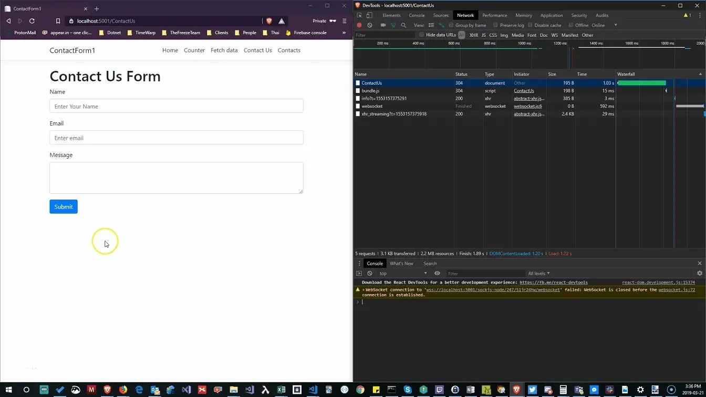

While doing a coding [kata](https://en.wikipedia.org/wiki/Kata_(programming))/challenge with colleague to build a "Contact Us" Form in React, ...

## Goal "get done fast"

We were trying to simulate code challenges given to job candidates, and thus we wanted to get done fast. 
We were trying to do the simplest thing that would work, balanced with the ability to explain it and for others to understand it.

It turned out to help solidify some things in my mind.

## The purpose of form validation

Let the user know something is invalid so they can fix it and continue the process.

## First things first

We started with the dotnet react template (the `ClientApp` is a react project using Create React App).

```console
dotnet new react -n ContactUsForm
```

We need a page and route and a link.
To do this we:
* make a copy of the Home.js file named ContactUsForm.js
* update the App.js to include the route
* update the NavMenu.js to add a link to the route/page.

At that point we could get to the page we wanted to be the ContactUsForm

## What data do we need on a Contact Us Form?

We wanted to "get done fast" so we went with the minimal:
* name
* email
* message

## How do we get the user's data?

  We started with the html/jsx minimal
* name: use label and input tag
* email: use label and  input tag
* message:  use label and textarea
* add a button to submit the form
  >we dont' implement the dispatching of anything on submit as that is not the point of the exercise)

## Minimal style

Given the template includes [Boostrap 4](https://getbootstrap.com/docs/4.0/components/forms/) and we want to "get done fast" we utilize it.

* group together `label`s and `input`s inside a `div` and use bootstrap `form-group` class
* add `form-control` class to `input` elements
* copy the button straight from the boostrap docs and change `class` (reserved word) to `className` for jsx

```jsx
<button type="submit" className="btn btn-primary">Submit</button>
```

## How to manage the state?

Well we need to "get done fast" so React State it is.

```javascript
  constructor(props) {
    super(props);
    this.state = {
      name: '',
      email: '',
      message: ''
    };
  }
```

## How do we update the state using the html input's?

We opted to use the property names used in `state` as the `id`s on the `input`s and `textarea`.
This way we can add an `onChange` attribute and the `event.target.id` will correlate to the correct `state` property.  This makes the update pretty easy.

```javascript
  changeHandler = (event) => {
    this.setState({ [event.target.id]: event.target.value });
  };
```

The `event.target.id` will equal "name", "email" or "message" and the value will be what the user entered in the associated html control.

## Submit the form

Create `submitHandler` and wire it up to the Form `onSubmit` attribute.
HTML forms default submit behavior is to do a post back.  Given we are using React we don't want to do the default so we add `event.preventDefault()` to our handler. 

```javascript
  submitHandler = (event) => {
    event.preventDefault();
    console.log("dispatch an action");
  };
```

The point of the kata is to build a form not the endpoint to handle it so the `console.log` is good enough.

## Validation????

This was an enlightening part. First thing I thought was "we have a library for that?" 
But we wanted to "get done fast". I did a quick search and saw a tweet from
[Cory House](https://twitter.com/housecor/status/1057288946261131264)

I thought, "What validation can I do with HTML5? I probably need to write special validation." So I did. Once I was done I realized I didn't do anything special:

* is it required
* is it an email
* min length
  
So I deleted the special validation code.

It turns out that HTML5 isn't bad at single property validation.

The [input](https://www.w3schools.com/tags/tag_input.asp) tag supports `required`, `minLength`, `maxLength`, `pattern` coupled with the various [types](https://www.w3schools.com/html/html_form_input_types.asp) one can cover a pretty good amount. And all of the client side requirements I had hand written.

So we updated the html tags with our validation settings.

## How do we reflect the validity of the form to the user?

We went back to the [Bootstrap docs](https://getbootstrap.com/docs/4.0/components/forms/#validation) and saw how to use the Html5 validation API with bootstrap.

Turns out this isn't too hard either. We update our `form` tag to include the `noValidate` attribute.  This turns off the browsers default validation handling and lets us use the bootstrap version.  We also add the Bootstrap class `needs-validation` which turns on the bootstrap version.

In our `submitHandler` we can add the Bootstrap class `was-validated` which will then trigger the validation display.  (Green is good, red is error).

## Tell the user the error.

For each `form-group` we add a `div` to display the constraints on the input to the user.
We add the BootStrap class `invalid-feedback` as in:

```jsx
<div className="invalid-feedback">
  Name is required with minimum length of 3 and max of 20
</div>
```

And now Boostrap does the rest.

## How do we know if the form is Valid?

The Html5 `Form` element has a function `checkValidity` that checks if all child elements are valid. Armed with this knowledge we can now prevent the form from dispatching when it is invalid.

```javascript
  submitHandler = (event) => {
    event.preventDefault();
    event.target.className += " was-validated";
    // multiple property validation could go here
    if (event.target.checkValidity()) {
      console.log("dispatch an action");
    }
  };
```



There we have it a decent form: 

```javascript
import React, { Component } from 'react';

export class ContactUsForm extends Component {
  static displayName = ContactUsForm.name;

  constructor(props) {
    super(props);
    this.state = {
      name: '',
      email: '',
      message: ''
    };
  }

  submitHandler = (event) => {
    event.preventDefault();
    event.target.className += " was-validated";
    // multiple property validation could go here
    if (event.target.checkValidity()) {
      console.log("dispatch an action");
    }
  };

  changeHandler = (event) => {
    this.setState({ [event.target.id]: event.target.value });
  };

  render() {
    return (
      <div>
        <h1>Contact Us Form</h1>

        <form className="needs-validation" noValidate onSubmit={this.submitHandler}>
          <div className="form-group">
            <label htmlFor="name">Name</label>
            <input
              className="form-control"
              id="name"
              onChange={this.changeHandler}
              placeholder="Enter Your Name"
              required
              minLength="3"
              maxLength="20"
              type="text"
              value={this.state.name}
            />
            <div className="invalid-feedback">
              Name is required with minimum length of 3 and max of 20
            </div>
          </div>
          <div className="form-group">
            <label htmlFor="email">Email</label>
            <input
              type="email"
              className="form-control"
              id="email"
              placeholder="Enter email"
              required onChange={this.changeHandler}
              value={this.state.email}
            />
            <div className="invalid-feedback">
              Please provide valid email.
            </div>
          </div>
          <div className="form-group">
            <label htmlFor="message">Message</label>
            <textarea
              className="form-control"
              id="message"
              rows="3"
              required
              onChange={this.changeHandler}
              value={this.state.message}
            />
            <div className="invalid-feedback">
              A message is required
            </div>
          </div>

          <button className="btn btn-primary" type="submit">Submit</button>
        </form>
      </div>
    );
  }
}
```
