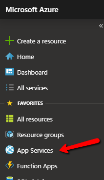
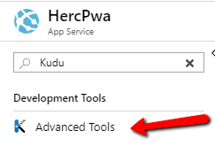
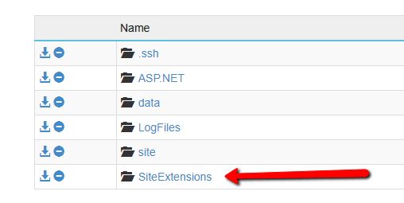
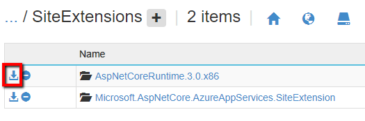
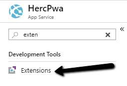
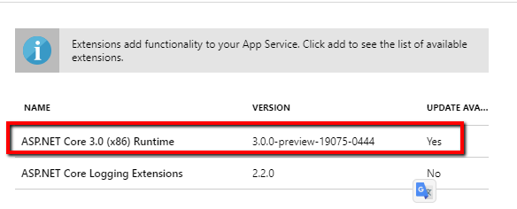

I am using Blazor in an app and I need to use AspNetCoreRuntime.3.0.x86 version 3.0.0-preview-19075-0444   (One version behind latest as of 2019-03-30)

Azure extensions, the best I could tell, only let you install the latest version. 
If you have an older version it will let you update but I couldn't figure out how to downgrade or install an older version.

Thankfully I have another site with an old version installed already. 
After reading this [post](https://www.michaelcrump.net/azure-tips-and-tricks21/) from Michael Crump, I decided to try to manually install the extension via Kudu tools and it worked.

See below for the steps I took:

* Open https://portal.azure.com

* Select App Services

* Select the app service with the old extension installed.
Filter for Kudu and select `Advanced Tools`

* Select Go (this will open the Kudu Advanced Tools in another tab)

* From the `Debug console` Menu dropdown select `PowerShell`

* Select the `SiteExtentions` Folder

Download the `AspNetCoreRuntime.3.0.x86` folder

Return to azure portal tab and select the App Service where you want to copy the extention.
Repeating the steps to open Kudu and navigate to the SiteExtention folder.

Press the Plus to create a new folder named `AspNetCoreRuntime.3.0.x86`

Inside the newly created folder drag the zip file you downloaded to the top right where "Drop and unzip" will appear, then release.

Once completed, return to Azure portal
* Restart your app service
* Filter and select Extentions

Now you should see the new extension.

## References

Michael Crump https://www.michaelcrump.net/azure-tips-and-tricks21/
