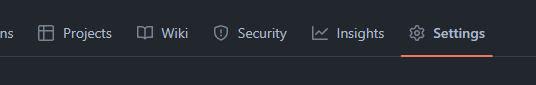
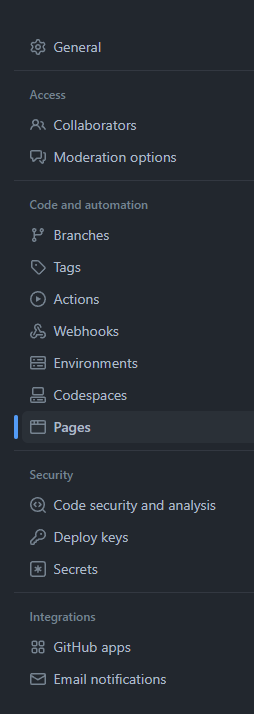
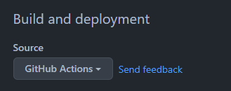
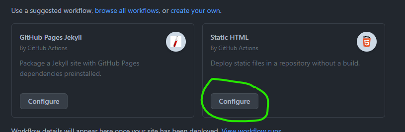
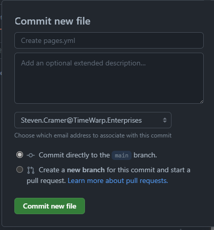
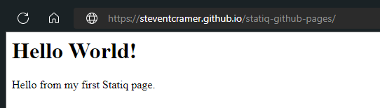

A step by step walk through on how to create a Statiq site and deploy it to GitHub Pages.

## Video walk through


## Prerequisites

git (`winget install Git.Git`)
GitHub CLI (`winget install GitHub.cli`)
dotnet 6.0 (`winget install Microsoft.DotNet.SDK.6`)

You will need a GitHub Account.

## Step by step
### Login to gh

```console
gh auth login
```

Follow the prompts.

### Create the repo

```console
gh repo create statiq-github-pages --public --gitignore VisualStudio
```

### Enable GitHub pages

1. Open your newly created repo in the browser

    ```console
    gh repo view statiq-github-pages --web
    ```

1. From the horizontal navigation bar select "Settings"

      

1. On the left choose `Pages`

      

1. Select "GitHub Actions" as the "Build and deployment" "Source"

      

1. Select Configure next to "Static HTML" for the workflow.

      

1. Update the `pages.yaml` as follows:

    ```yml
    # Simple workflow for deploying static content to GitHub Pages
    name: Deploy static content to Pages

    on:
      # Runs on pushes targeting the default branch
      push:
        branches: ["main"]

      # Allows you to run this workflow manually from the Actions tab
      workflow_dispatch:

    # Sets permissions of the GITHUB_TOKEN to allow deployment to GitHub Pages
    permissions:
      contents: read
      pages: write
      id-token: write

    # Allow one concurrent deployment
    concurrency:
      group: "pages"
      cancel-in-progress: true

    jobs:
      # Single deploy job since we're just deploying
      deploy:
        environment:
          name: github-pages
          url: ${{ steps.deployment.outputs.page_url }}
        runs-on: ubuntu-latest
        steps:
          - name: Checkout
            uses: actions/checkout@v3
          - name: generate statiq site
            uses: actions/setup-dotnet@v1
            with:
              dotnet-version: '6.0.401'
          - run: dotnet run --project ./MyGenerator/MyGenerator.csproj
          - name: Setup Pages
            uses: actions/configure-pages@v2
          - name: Upload artifact
            uses: actions/upload-pages-artifact@v1
            with:
              # Upload entire repository
              path: './MyGenerator/output'
          - name: Deploy to GitHub Pages
            id: deployment
            uses: actions/deploy-pages@v1
    ```

1. Select `Start commit` near the top right

      

1. Then choose `Commit new file`

      

GitHub Pages is now enabled and will automatically update as commits are merged into the `master/main` branch.

Return to the console for next steps

### Clone the git repo

```console
gh repo clone statiq-github-pages
cd .\statiq-github-pages\
```

### Write the dotnet project

1. create new console app

    ```console
    dotnet new console -n MyGenerator
    cd .\MyGenerator\
    ```

1. Add the Statiq.Docs Nuget package

    ```console
    dotnet add package Statiq.Docs --version 1.0.0-beta.5
    ```

1. Edit Program.cs to contain the following:

  ```cs
  await Bootstrapper
    .Factory
    .CreateDocs(args)
    .RunAsync();
  ```

1. Create `input` folder

    ```console
    mkdir input
    ```

1. Create `index.md` in the `input` folder as

    ```md
    Title: My First Statiq page
    ---
    # Hello World!

    Hello from my first Statiq page.

    ```

1. add, commit and push

    ```console
    git add --all
    git commit -m "My Statiq Github pages site"
    git push
    ```

## Enjoy

Browse to the published site.

`https://YOURPROFILE.github.io/statiq-github-pages/`

  

## References

https://docs.github.com/en/pages/getting-started-with-github-pages/creating-a-github-pages-site#creating-your-site

[Dream Studio AI](https://beta.dreamstudio.ai/) was used to generate the cover image.
