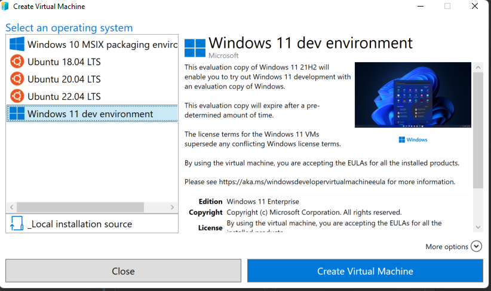
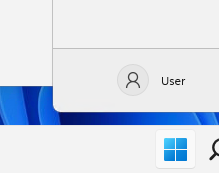
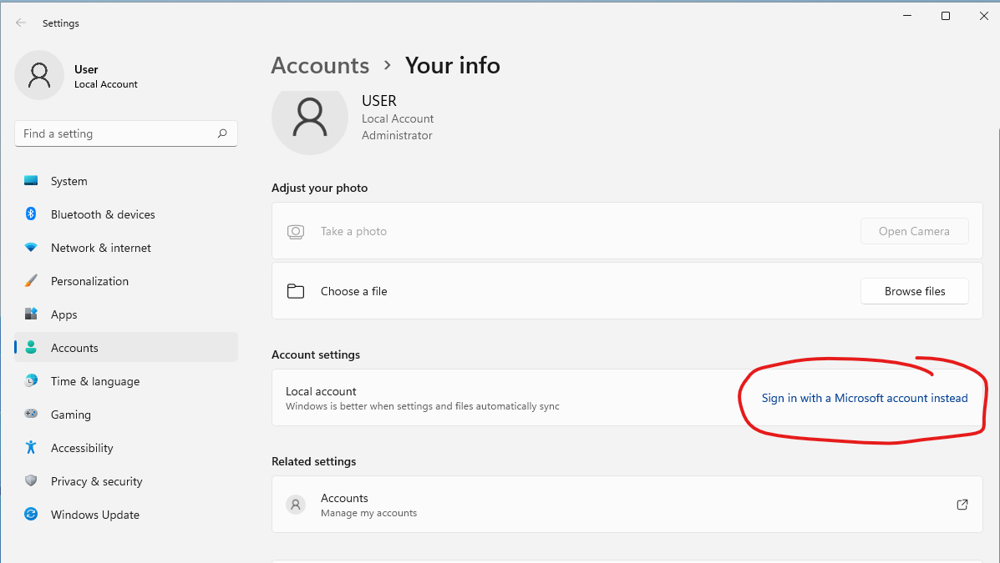
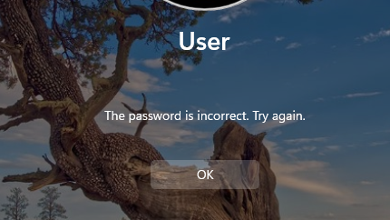

# Why can't I log in to a Windows Hyper-V VM with my Microsoft Account

So I want to test Azure VPN service.  I use Hyper-V Quick Create to create VM

By default an admin user named "User" is created with no password.

If you click on Start and then the User Avatar

It will bring you to the Account Settings.

If I set up my Microsoft account I can no longer log into the VM.  When connecting I get "The password is incorrect. Try again.

So why can't I login??
