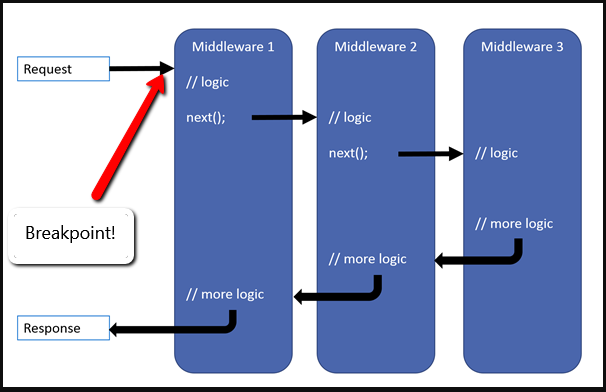
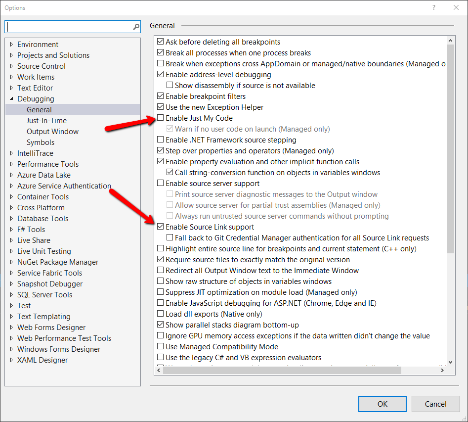
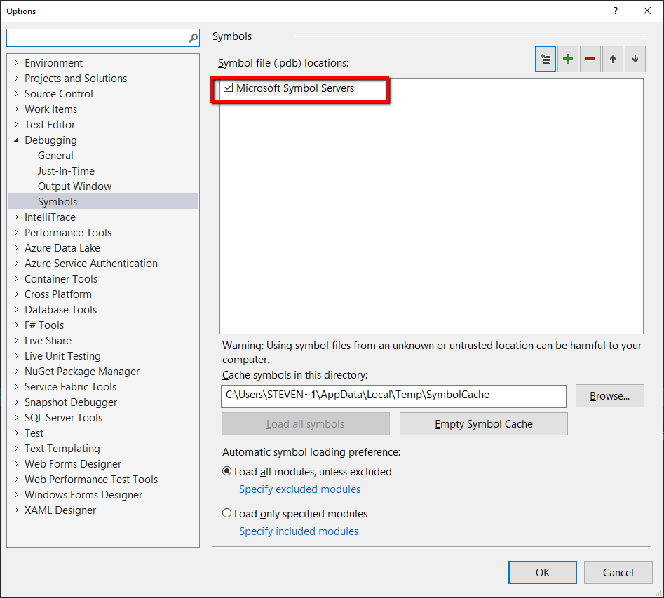
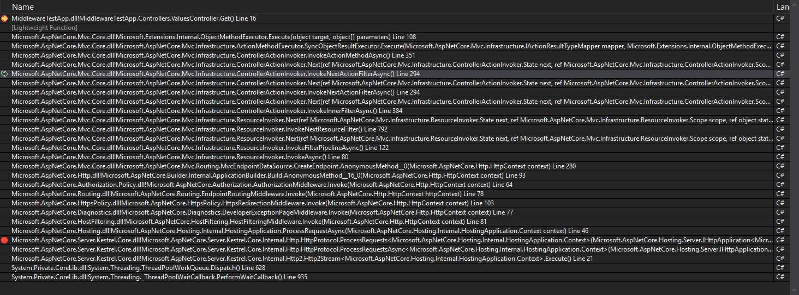

"I just want to break on the next request that comes to the server at the begining of the pipeline"

When debugging asp.net core 
[middleware](https://docs.microsoft.com/en-us/aspnet/core/fundamentals/middleware/?view=aspnetcore-3.0)
there are times I just want to walk through the whole process.

But where can I set a break point?

Well you could go through all your controllers and set a break point in the constructor.
But all middleware will have run each "pre action" prior to your breakpoint.

So how do you do it for every request with only one breakpoint? 

# Source Link to the rescue

To enable [Source Link](https://docs.microsoft.com/en-us/dotnet/standard/library-guidance/sourcelink) in Visual Studio 
2019 Preview:

Select Tools=>Options

Debugging:
  General section:
  * Uncheck `Enable Just My Code`
  * Check `Enable Source Link Support` 

  Symbols section:
  * Check Microsoft Symbol Servers

Now put a break point in any of your controllers and view the call stack.

In this example I am using the default API template and have a breakpoint in the Values controller.  In the callstack,you can see all of the AspNetCore calls as well.

Now that you have SourceLink enabled you can double click any of the items in the call stack and it will load the 
source and you can set a breakpoint on them.

What also is beautiful about this is that dotnet core is documented in the source and you can click on each item in
the stack and read what its purpose is.

I like to set the breakpoint on the last item inside kestrel.  Currently that is Line 566 in HttpProtocol.cs Prior to running any of the middleware.

With a breakpoint there I can see every request.

> Remember the server could have multiple requests coming in at once from the same page not to mention multiple sessions.
With async await stepping through code may be a bit more confusing than synchronous.

Tools: Visual Studio 2019 Preview
