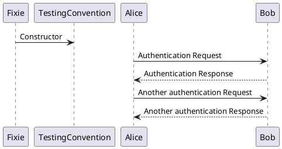

  Title: Empowering Title
  Published: 01/05/2021
  Tags:
  - CSharp
  - Blazor
  Image: main_image.webp
  Description: Description of article
  Excerpt: Excerpt for Twitter
  Author: Steven T. Cramer
---

# TimeWarp Blazor Template Updates

## Startup Hosted Service

## Fluent Validation of Configuration Options

## User Preference Storage using Entity Framework and Cosmos DB

## Oakton for command line features

### Displaying configuration information via Describe.ps1

# Testing in Fixie

