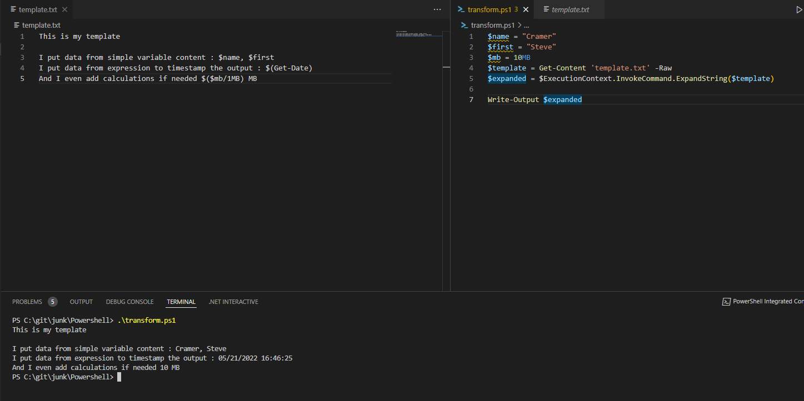

  

```txt
This is my template
 
I put data from simple variable content : $name, $first
I put data from expression to timestamp the output : $(Get-Date)
And I even add calculations if needed $($mb/1MB) MB 
```

```Powershell
$name = "Cramer"
$first = "Steve"
$mb = 10MB
$template = Get-Content 'template.txt' -Raw
$expanded = $ExecutionContext.InvokeCommand.ExpandString($template)

Write-Output $expanded
```

```console
PS C:\git\junk\Powershell> .\transform.ps1
This is my template
 
I put data from simple variable content : Cramer, Steve
I put data from expression to timestamp the output : 05/21/2022 16:46:25
And I even add calculations if needed 10 MB 
```
