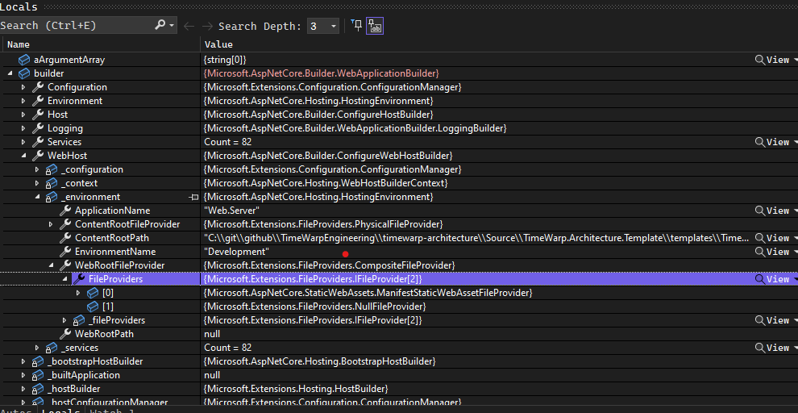
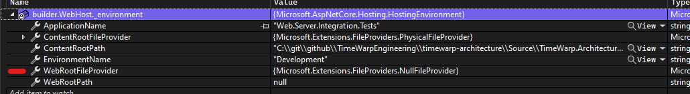

  Title: Run full webserver inside Integration Tests
  Published: 01/05/2021
  Tags:
  - CSharp
  - dotnet
  - Kestrel
  - test
  Image: main_image.webp
  Description: Launch your dotnet web app from your integration tests
  Excerpt: Excerpt for Twitter
  Author: Steven T. Cramer
  ---

How to launch your fully functional dotnet web application from your integration test.

> TLDR;
> Set ApplicationName in WebApplicationOptions sent to WebApplication.CreateBuilder
```cs
WebApplication.CreateBuilder
(
  new WebApplicationOptions
  {
    ApplicationName = typeof(Web_Server_Assembly).Assembly.GetName().Name // <==
  }
);
```
## The Story

I have a dotnet Blazor application (`Web.Server`) that runs fine when launched from VS or `dotnet run`, on which I want to run integration test.

When attempting to launch my Blazor`Web.Server` from my integration tests.  I received the following:

```console
System.InvalidOperationException: Cannot find the fallback endpoint specified by route values: { page: /_Host, area:  }.
...
```

My first thought was. "I must be creating the WebApplication differently in my test application than I am when running directly."

The code used to create the `WebApplicationBuilder` in `Web.Server.Program` is as follows

```cs
public static Task<int> Main(string[] args)
  {
    WebApplicationBuilder builder = WebApplication.CreateBuilder(args);
    ...
  }
```

The code I was using in the test application was:

```cs
WebApplicationBuilder builder = WebApplication.CreateBuilder();
```

I was passing no `args` when running directly so the code was effectively the same.

I deduced that the problem was caused from the context in which I was running.  I mean the code is the same so what else could it be?  But what was different?

## One Of These Things Is Not Like The Other

I set a break point after creating the builder in both the application and the test case.  And went about inspecting the to see if I could tell what was different between them. And yes there was something different.

Inside `builder.WebHost._environment.WebRootFileProvider` I noticed the working one was a `CompositeFileProvider` that contained 2 `FileProviders`

  

 and when running from the test it was `NullFileProvider`

  

## Found the difference but now Why?

Given my code was the same, to determine why dotnet was creating different a `WebRootFileProvider` I needed to [debug into the dotnet code]() to see where it created this WebRootFileProvider.

I probably followed the trace 100x (seriously this whole process took me 2 days) until finally the culprit was found. 

```console
 	Microsoft.AspNetCore.Hosting.dll!Microsoft.AspNetCore.Hosting.StaticWebAssets.StaticWebAssetsLoader.ResolveRelativeToAssembly(Microsoft.AspNetCore.Hosting.IWebHostEnvironment environment) Line 70	C#
 	Microsoft.AspNetCore.Hosting.dll!Microsoft.AspNetCore.Hosting.StaticWebAssets.StaticWebAssetsLoader.ResolveManifest(Microsoft.AspNetCore.Hosting.IWebHostEnvironment environment, Microsoft.Extensions.Configuration.IConfiguration configuration) Line 51	C#
 	Microsoft.AspNetCore.Hosting.dll!Microsoft.AspNetCore.Hosting.StaticWebAssets.StaticWebAssetsLoader.UseStaticWebAssets(Microsoft.AspNetCore.Hosting.IWebHostEnvironment environment, Microsoft.Extensions.Configuration.IConfiguration configuration) Line 27	C#
 	Microsoft.AspNetCore.dll!Microsoft.AspNetCore.WebHost.ConfigureWebDefaults.AnonymousMethod__9_0(Microsoft.AspNetCore.Hosting.WebHostBuilderContext ctx, Microsoft.Extensions.Configuration.IConfigurationBuilder cb) Line 223	C#
 	Microsoft.AspNetCore.Hosting.dll!Microsoft.AspNetCore.Hosting.GenericWebHostBuilder.ConfigureAppConfiguration.AnonymousMethod__0(Microsoft.Extensions.Hosting.HostBuilderContext context, Microsoft.Extensions.Configuration.IConfigurationBuilder builder) Line 182	C#
 	Microsoft.AspNetCore.dll!Microsoft.AspNetCore.Hosting.BootstrapHostBuilder.RunDefaultCallbacks(Microsoft.Extensions.Configuration.ConfigurationManager configuration, Microsoft.Extensions.Hosting.HostBuilder innerBuilder) Line 133	C#
 	Microsoft.AspNetCore.dll!Microsoft.AspNetCore.Builder.WebApplicationBuilder.WebApplicationBuilder(Microsoft.AspNetCore.Builder.WebApplicationOptions options, System.Action<Microsoft.Extensions.Hosting.IHostBuilder> configureDefaults) Line 87	C#
 	Microsoft.AspNetCore.dll!Microsoft.AspNetCore.Builder.WebApplication.CreateBuilder(Microsoft.AspNetCore.Builder.WebApplicationOptions options) Line 115	C#
>	Testing.Common.dll!TimeWarp.Architecture.Testing.WebApplicationHost<TimeWarp.Architecture.Web.Server.Program>.WebApplicationHost(string[] aUrls, Microsoft.AspNetCore.Builder.WebApplicationOptions aWebApplicationOptions, System.Action<Microsoft.Extensions.DependencyInjection.IServiceCollection> aConfigureServicesDelegate) Line 46	C#

```

## The Problem

When running from a test the running assembly is your test assembly (`Web.Server.Integration.Tests`) not the web application assembly (`Web.Server`).

"So what?" you say.  Why would that matter, I didn't think it would obviously. But it does!

When dotnet builds my `Web.Server` application it creates a json file named `$"Web.Server.staticwebassets.runtime.json"`

This file contains information as to where the csproj file is located and where your web application content should be found. Dotnet tries to resolve the manifest `ResolveManifest`, relative to an assembly named `environment.ApplicationName`.

See the dotnet code snippet from Microsoft.AspNetCore.Hosting.StaticWebAssets.StaticWebAssetsLoader class:

```cs
private static string ResolveRelativeToAssembly(IWebHostEnvironment environment)
{
    var assembly = Assembly.Load(environment.ApplicationName);
    var basePath = string.IsNullOrEmpty(assembly.Location) ? AppContext.BaseDirectory : Path.GetDirectoryName(assembly.Location);
    return Path.Combine(basePath!, $"{environment.ApplicationName}.staticwebassets.runtime.json");
}
```

`environment.ApplicationName` defaults to the running assembly. And there is no `Web.Server.Integration.Tests.staticwebassets.runtime.json` Thus the dotnet code returns null for the `ResolveManifest` when running from the test.

Snippet of the ResolveManifest source.
```cs
internal static Stream? ResolveManifest(IWebHostEnvironment environment, IConfiguration configuration)
{
    try
    {
        var candidate = configuration.GetValue<string>(WebHostDefaults.StaticWebAssetsKey) ?? ResolveRelativeToAssembly(environment);
        if (candidate != null && File.Exists(candidate))
        {
            return File.OpenRead(candidate);
        }

        // A missing manifest might simply mean that the feature is not enabled, so we simply
        // return early. Misconfigurations will be uncommon given that the entire process is automated
        // at build time.
        return default;
    }
    catch
    {
        return default;
    }
}
```        

The comment indicates that this is unexpected scenario, and I wonder if throwing and exception here would make sense, but that isn't my call.

### Where is this `environment.ApplicationName` configured?

So after finally finding what "context" was different I needed to figure out to make them the same.  So "Where is this `environment.ApplicationName` configured?"

Turns out to be very simple to set. `WebApplication.CreateBuilder` has an overload that takes a `WebApplicationOptions` parameter and inside that class you can configure the `ApplicationName` Once I set that to `Web.Server` everything worked.

```cs
WebApplication.CreateBuilder
(
  new WebApplicationOptions
  {
    ApplicationName = typeof(Web_Server_Assembly).Assembly.GetName().Name // <==
  }
);
```
## Parting words

Don't feel bad if you didn't see this solution, you are not alone. See the references for others that struggled also.

# References

https://stackoverflow.com/questions/72928110/why-wont-unit-tests-connect-to-a-websocket
https://github.com/dotnet/aspnetcore/issues/42657
